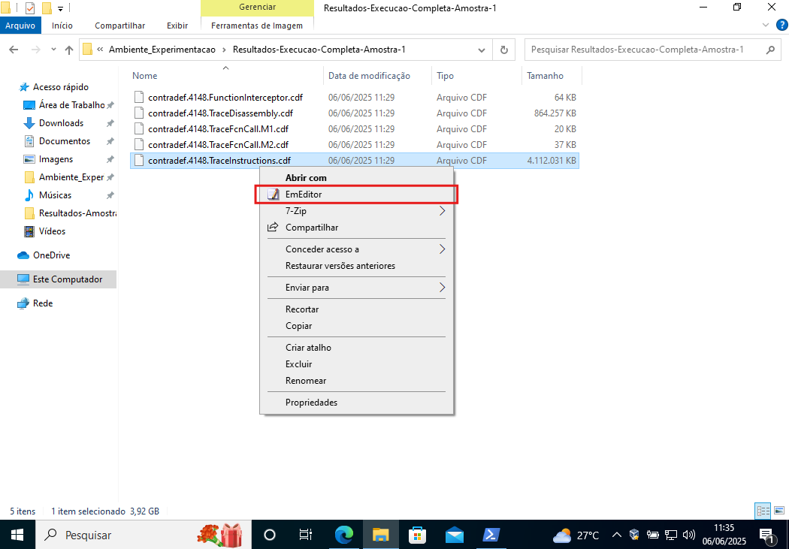
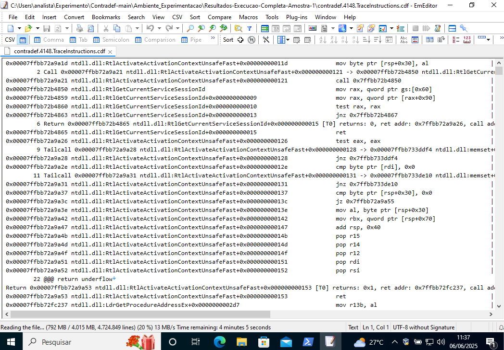

# **Contradef — Uma Ferramenta de Instrumentação Binária Dinâmica para Análise de Malware Evasivo**

A **Contradef** é uma ferramenta de Instrumentação Binária Dinâmica (DBI) — implementada sobre o Intel Pin — dedicada à investigação de _malware_ evasivo em executáveis Windows x64.  

## Resumo do artigo
A Contradef é uma ferramenta DBI, desenvolvida sobre o Intel Pin, para a análise de software evasivo, por meio de técnicas de *tracing*. Ela registra, em arquivos, o fluxo de instruções, os acessos à memória, as chamadas de API e outros estados internos, permitindo que esses dados sejam investigados depois da execução.
Desta forma, a análise desses registros permite revelar técnicas de ofuscação e evasão, empregadas por empacotadores de software, como o VMProtect. 

---

## Sumário

- [1. Estrutura do README.md](#1-estrutura-do-readmemd)
  - [1.1 Organização do README.md](#11-organização-do-readmemd)
  - [1.2 Artefatos distribuídos](#12-artefatos-distribuídos-neste-repositório)
  - [1.3 Estrutura do repositório](#13-estrutura-do-repositório)
- [2. Selos Considerados](#2-selos-considerados)
- [3. Informações básicas](#3-informações-básicas)
  - [3.1 Introdução à execução](#31-introdução-à-execução-da-ferramenta-e-aos-experimentos)
  - [3.2 Características principais](#32-características-principais-da-contradef)
  - [3.3 Arquitetura](#33-arquitetura-da-ferramenta)
  - [3.4 Como a execução é estruturada](#35-como-a-execução-é-estruturada)
  - [3.5 Ambiente recomendado](#34-ambiente-de-execução-recomendado)
- [4. Dependências](#4-dependências)
  - [4.1 Compilação (host)](#41-dependências-para-compilação-host-windows)
  - [4.2 Criação da VM](#42-dependências-na-criação-da-vm)
  - [4.3 Execução (guest)](#43-dependências-para-execução-na-vm-windows)
- [5. Preocupações com segurança](#5-preocupações-com-segurança)
  - [5.1 Principais vetores de risco](#51-principais-vetores-de-risco)
  - [5.2 Medidas obrigatórias](#52-medidas-obrigatórias)
  - [5.3 Declaração de responsabilidade](#53-declaração-de-responsabilidade)
- [6. Instalação](#6-instalação)
  - [6.1 Procedimento de compilação](#61-procedimento-de-compilação-opcional)
    - [6.1.1 Obter o código-fonte](#611-obter-o-código-fonte)
    - [6.1.2 Instalar dependências](#612-instalar-dependências)
    - [6.1.3 Compilar](#613-compilar)
  - [6.2 Execução](#62-execução)
    - [6.2.1 Parâmetros comuns](#621-parâmetros-comuns)
    - [6.2.2 Sintaxe básica](#622-sintaxe-básica)
- [7. Teste mínimo](#7-teste-mínimo)
  - [7.1 Pré-requisitos](#71-pré-requisitos)
  - [7.2 Passo a passo](#72-passo-a-passo)
- [8. Experimentos](#8-experimentos)
  - [8.1 Preparando o ambiente](#81-preparando-o-ambiente-de-experimentação)
    - [8.1.1 Instalar o VirtualBox](#811-instalar-o-virtualbox)
    - [8.1.2 Baixar a ISO do Windows](#812-baixar-a-imagem-iso-do-windows)
    - [8.1.3 Criar a VM](#813-criar-a-vm-no-virtualbox-ver-detalhes)
    - [8.1.4 Instalar o Windows](#814-instalar-o-windows-na-vm-ver-detalhes)
    - [8.1.5 Snapshot “limpo”](#815-criar-snapshot-da-vm-limpa-ver-detalhes)
    - [8.1.6 Ajustes no guest](#816-ajustes-no-windows-convidado-vm-ver-detalhes)
  - [8.2 Reproduzindo os experimentos](#82-reproduzindo-os-experimentos-ver-detalhes)
    - [8.2.1 Preparação](#821-preparação)
    - [8.2.2 Terminal de execução](#822-terminal-de-execução)
    - [8.2.3 Medição de tempo](#823-medição-de-tempo-opcional)
    - [8.2.4 Execução da Amostra 1](#824-execução-da-amostra-1-vmprotect)
    - [8.2.5 Execução da Amostra 2](#825-execução-da-amostra-2-comportamento-evasivo)
    - [8.2.6 Observações de desempenho](#826-observações-de-desempenho)
  - [8.3 Inspeção de resultados](#83-inspeção-de-resultados)
    - [8.3.1 Acessar os logs](#831-acessar-os-logs-de-execução)
    - [8.3.2 Abrir e inspecionar](#832-abrir-e-inspecionar-os-logs)
- [9. Licença](#9-licença)

---

# 1. Estrutura do README.md

## 1.1. Organização do README.md

**Este README.md está organizado nas seguintes seções principais:**

1. **Estrutura do README.md** – visão geral de como o documento e o repositório estão organizados.
2. **Selos Considerados** – selos e critérios de artefato que o projeto pretende atender.
3. **Informações básicas** – introdução aos experimentos, características da Contradef, arquitetura e ambiente recomendado.
4. **Dependências** – requisitos de hardware / software para compilar, criar a VM e executar a ferramenta.
5. **Preocupações com segurança** – boas-práticas e checklist para garantir isolamento e evitar contaminação.
6. **Instalação** – procedimentos de compilação (opcional) e execução básica da pintool.
7. **Teste mínimo** – passo a passo rápido usando o executável benigno (7Zip) para validar a instalação.
8. **Experimentos** – preparação detalhada do ambiente, execução das amostras, coleta e análise de logs.
9. **Licença** – termos de uso e distribuição do código-fonte e dos artefatos.

## 1.2. Artefatos distribuídos neste repositório:

* Código fonte da **Contradef**.  
* Uma versão da **Contradef (contradef.dll)** compilada e pronta para uso.  
* Guias de configuração para o ambiente de experimentação, que garantem ambiente seguro e reprodutível.  
* Scripts de automação para configuração do ambiente de expreimentação dentro do ambiente isolado (VM).  
* Duas amostras de malware compactadas, para execução dos exeprimentos.
* Código fonte da biblioteca **YARA** para integração com a **Contradef**.  


## 1.3. Estrutura do repositório

```text
Contradef/                            ← Diretório principal do repositório. Pode ser nomeado como *Contradef-main* quando baixado como .zip e descompactado com o mesmo nome
├── Ambiente_Experimentacao           ← Ambiente preparado com artefatos para execução dos experimentos
|   ├── Amostras/                     ← Contém amostra reais de malwares compactadas
|   ├── ContradefDll/                 ← DLL Contradef já compilada (x64/Debug)
├── Contradef/                        ← código-fonte (.cpp/.h)
├── docs/                             ← Recursos para o README.md e tutoriais de configuração
├── pin/                              ← Intel Pin 3.28 descompactado
├── Resultados_Experimentos_Artigo/   ← Resultados dos experimentos do artigo
├── Scripts/                          ← Scripts de configuração rápida para o ambiente de experimentação dentro da VM
├── yara/                             ← YARA 4.5.2 (inclui a biblioteca)
└── yaracontradef/                    ← Implementação para integração da lib YARA com a Contradef 
```

> ⚠️ **Importante:** O nome do repositório pode ser *Contradef-main* no lugar de *Contradef* quando baixado como .zip e descompactado com o mesmo nome (Contradef-main).

A principal meta dos artefatos é permitir que avaliadores:

1. Explorem o código da **Contradef**.
1. Verifiquem a **funcionalidade** da **Contradef** (teste mínimo).  
2. Reproduzam os **experimentos completos** descritos no artigo, observando a geração de *traces* de instrução, memória, chamadas de API e suas correlações.  
3. Avaliem o **overhead** e a robustez da Contradef frente a *malware* evasivo.

---

# 2. Selos Considerados

Os selos considerados são: Disponíveis, Funcionais, Sustentáveis e Reprodutíveis.

---

# 3. Informações básicas

## 3.1 Introdução à execução da ferramenta e aos experimentos

**Contradef** é uma *pintool* construída sobre o Intel Pin que injeta
ganchos (*hooks*) em tempo de execução para registrar instruções,
acessos à memória e chamadas de API em executáveis Windows x64.

Os experimentos deste repositório têm dois propósitos principais:

1. **Validar funcionalidades** – comprovar que cada módulo  
   (`InterceptFunctions`, `TraceFcn`, `TraceMem`, `TraceInstr`,
   `TraceDasm`) opera isoladamente **e** em conjunto, gerando *logs*
   coerentes.
2. **Avaliar impacto** – medir tempo de execução e volume de *traces*
   ao instrumentar **amostras reais de malware**  
   (Amostra 1 protegida por **VMProtect** e Amostra 2 que adota técnicas
   anti-análise).

Nos experimentos, a Contradef é executada dentro de uma máquina virtual Windows x64 sem acesso à rede, partindo sempre de um snapshot limpo. Inicialmente cada módulo da ferramenta é ativado isoladamente sobre dois executáveis de referência: um protegido pelo empacotador VMProtect e outro que utiliza múltiplas técnicas anti-análise. Em seguida a pintool é aplicada com todos os módulos simultâneos para produzir um *trace* completo, enquanto o tempo de execução e o tamanho dos arquivos de log são coletados para avaliar overhead. Ao final, os registros gerados são inspecionados em um editor capaz de lidar com grandes volumes de texto (EmEditor), permitindo confirmar a captura de instruções, parâmetros de APIs e acessos de memória, bem como observar como as proteções dos binários se manifestam em cada estágio da análise.

> ⚠️ **Ambiente isolado e controlado**  
> Todos os testes são executados **dentro de uma VM**, restaurada de
> snapshot limpo após cada amostra, evitando contaminação do host e
> garantindo reprodutibilidade.

> 💡 **Uso em binários benignos**  
> Para depuração, engenharia reversa ou estudo de empacotadores em
> executáveis legítimos, a Contradef pode rodar diretamente no host sem
> VM nem desativar antivírus — basta chamar Pin + Contradef via PowerShell
> e apontar para o binário benigno (por exemplo, `7za.exe`).


## 3.2. Características principais da Contradef

* **FunctionInterceptor** — *hooking* seletivo de mais de 100 APIs sensíveis (p. ex. `GetProcAddress`, `VirtualProtect`, `NtQueryInformationProcess`), registrando parâmetros e valor de retorno.  
* **TraceFcnCall** — dois métodos complementares para registrar chamadas:  
  1. instruções `call` convencionais;  
  2. saltos indiretos obtidos em tempo de execução (`GetProcAddress`, `LoadLibrary`, etc.).  
  A combinação é necessária porque _malwares_ protegidos alternam entre os dois esquemas para mascarar APIs críticas.
* **TraceMemory** — log de leituras/escritas (até 16 bytes) com auto-detecção de _strings_ ASCII/Unicode, alerta de transição RW → RX (indício de desempacotamento) e exibição de dados decifrados (URLs C2, chaves, nomes de janela…).
* **TraceInstructions / TraceDisassembly** — registro sequencial de cada instrução executada, valores de registradores, *flags* e operandos imediatos; essencial para reconstituir o fluxo em binários ofuscados.
* **Análise estática opcional com YARA** — o parâmetro `-yara <regras.yar>` aponta um arquivo de regras; detecções prévias podem **ajustar automaticamente o escopo** dos módulos (p. ex. ativar apenas *hooks* de interesse em binários UPX, VMProtect etc.).  
  *Esta funcionalidade não foi necessária durante os experimentos.*

> *Os módulos da Contradef são **complementares**: dados de memória podem ser correlacionados com a linha temporal de chamadas e o fluxo exato de instruções.*

> *Atualmente a ferramenta suporta **apenas executáveis PE 64-bit nativos**; não há suporte direto a .NET, Java ou scripts.*

## 3.3. Arquitetura da ferramenta

<p align="center">
  
</p>

| Componente | Função resumida |
|------------|-----------------|
| **Instrumentation** | Núcleo que injeta *callbacks* em tempo de execução e despacha eventos para os módulos especializados. |
| **TraceMemory / TraceInstructions / TraceFcnCall / TraceDisassembly** | Módulos de coleta responsáveis, respectivamente, por acessos à memória, instruções executadas, chamadas de função e trechos desassemblados. Todos gravam resultados em **arquivos de log** independentes. |
| **FunctionInterceptor** | Implementa *hooking* seletivo de APIs sensíveis, redirecionando parâmetros e retornos ao respectivo arquivo de log. |
| **Instrumentation Strategy + Strategies** | Conjunto de regras de instrumentação que pode ser ativado ou trocado em tempo de execução (p. ex. interceptar apenas `GetWindowTextA`, `GetWriteWatch` etc.). |
| **Yara Lib** | Integração opcional para escanear o binário antes da execução; detecções podem definir quais estratégias ou módulos serão habilitados. |
| **Notifier → Observer** | Implementa o padrão *publish/subscribe*, permitindo que estratégias gerem eventos que serão registrados nos logs. |
| **Arquivos de log** | Ponto de convergência dos *traces*; cada módulo escreve no seu próprio arquivo, facilitando a correlação posterior. |

> *A natureza modular da Contradef permite ativar apenas os blocos necessários sem recompilar o restante da ferramenta.*

## 3.4. Como a execução é estruturada

1. **Ambiente isolado** – Todos os testes acontecem dentro de uma VM
   Windows 10/11 **sem rede** e partindo de um snapshot limpo. 
   Isso garante segurança e reprodutibilidade.
2. **Fluxo de execução dentro da VM**  
   1. Restaurar snapshot e desconectar rede.  
   2. Extrair amostra (`*.zip`).  
   3. Chamar o Pin + Contradef com os parâmetros desejados.  
   4. Mover os logs para as respectivas pastas de resultados.  
   4. Inspecionar os logs ou extrair as pastas de resultados da VM.  
   5. Restaurar snapshot antes da próxima amostra.
3. **Inspeção dos resultados** 
    Arquivos `contradef.<PID>.*.cdf` são texto puro e podem ser inspecionados diretamente na VM ou extraídos para análise no hospedeiro (host). O **EmEditor** é recomendado para logs > 2 GB.

Ao completar o roteiro de experimentação o avaliador terá:

* Um **snapshot limpo** pré-instrumentação.  
* Pastas **Resultados-Amostra-X** contendo os CDFs de cada flag.  
* Métricas de tempo via `Measure-Command`.

A execução detalhada dos passos será explicada em detalhes mais adiante.

## 3.5. Ambiente de Execução Recomendado

Para executar os experimentos, sugerimos a configuração abaixo:

| Camada              | Especificação recomendada |
|---------------------|---------------------------|
| **Máquina hospedeira** | • CPU multi-core com VT-x/AMD-V habilitado<br>• **RAM:** ≥ 16 GB<br>• **Armazenamento:** SSD NVMe ≥ 500 GB |
| **Hypervisor**      | Oracle **VirtualBox 7.0** (ou superior) |
| **Máquina virtual** | • **SO convidado:** Windows 10/11 x64<br>• **vCPU:** ≥ 4 núcleos dedicados<br>• **RAM:** 6 – 8 GB<br>• **Disco:** 80 – 200 GB<br> |

> **Por quê VirtualBox?** Suporte robusto a snapshots e VT-x/AMD-V, além de compatibilidade com Intel Pin.

> ⚠️ **Importante:** se você só quer executar os experimentos, a DLL precompilada da **Contradef**  
> está em **`Ambiente_Experimentacao\ContradefDll\contradef.dll`**.  
> Compile apenas se desejar alterar o código-fonte.

---

# 4. Dependências

A relação abaixo cobre **todo o ciclo** — da compilação no host até a
execução dos testes na VM — indicando versões mínimas e links oficiais.

## 4.1. Dependências para compilação (host Windows)

> ⚠️ **A compilação não é obrigatória** para repetir os experimentos:  
> o binário pronto está em **`Ambiente_Experimentacao\ContradefDll`** do repositório.  
> Compile apenas se quiser modificar o código-fonte.

| Ferramenta | Versão mínima | Observações |
|------------|---------------|-------------|
| **Visual Studio 2019** (ou 2022) | Community/Pro | Instale o *Desktop C++ Workload*. No VS 2022 marque o **toolset v142** para manter compatibilidade com o Pin. |
| **Windows 10 SDK** | 10.0.19041 | Vem com o instalador do VS. |
| **Intel Pin** | 3.28 (x64, MSVC) | Baixe em <https://software.intel.com/sites/landingpage/pintool/downloads/pin-3.28-98749-g6643ecee5-msvc-windows.zip> e extraia em `pin\` (mova **somente** o conteúdo evitando manter a subpasta gerada pela extração). |
| **YARA** *(já incluído)* | 4.5.2 | Já fornecido em `yara\` deste repositório (sob licença BSD 3-Clause). |

## 4.2. Dependências na criação da VM

| Ferramenta | Função | Link |
|------------|--------|------|
| **Oracle VirtualBox 7.x** | Hypervisor utilizado nos tutoriais, facilita snapshots e Guest Additions. | <https://www.virtualbox.org/> |

## 4.3. Dependências para execução na VM Windows

| Requisito | Motivo / Observação |
|-----------|---------------------|
| **Windows 10/11 x64** | Sistema convidado isolado para análise. |
| **Pin 3.28** | Necessário para execução dos experimentos. |
| **`contradef.dll`** | Use a DLL compilada no host (necessário transferir) **ou** a versão pronta em `Ambiente_Experimentacao\ContradefDll\`. |

Ferramentas auxiliares (dentro da VM):

| Ferramenta | Finalidade | Link |
|------------|------------|------|
| **7-Zip** | Descompactar amostras protegidas com a senha. | <https://www.7-zip.org/> |
| **EmEditor** | Abrir *logs* `.cdf` maiores que 2 GB sem travar. | <https://www.emeditor.com/> |
| **VirtualBox Guest Additions** | Habilitar pastas compartilhadas (opcional). | Incluído na ISO do VirtualBox |

---

# 5. Preocupações com segurança

A ferramenta Contradef **não contém código malicioso** — trata-se de uma _pintool_
em C/C++ que apenas coleta e grava *logs*.  
**O risco real vem das amostras de _malware_ que serão executadas** para
testar a ferramenta.  

## 5.1. Principais vetores de risco

| Vetor | Descrição |
|-------|-----------|
| **Execução da amostra** | Caso o *malware* consiga sair da VM, pode infectar o host. |
| **Rede** | Muitos *malwares* tentam baixar payloads ou exfiltrar dados. |
| **Pastas compartilhadas / Área de transferência** | Canal de escape para copiar arquivos maliciosos para o host. |

Para proteger quem avalia o artefato (revisores ou leitores do
repositório), siga as orientações abaixo.

## 5.2. Medidas obrigatórias

1. **Não executar os experimentos no sistema hospedeiro**  
   * Todo o experimento fica confinado à VM; nada é executado diretamente no
     sistema físico.  
2. **VM dedicada, sem acesso à rede durante a execução**  
   * VirtualBox → **Configurações > Rede > Conectado a > Não conectado**.  
3. **Snapshots**  
   * Use um snapshot limpo.  
   * Restaure-o **após cada execução de amostra**.  
4. **Pastas compartilhadas e área de transferência da VM**  
   * Desative enquanto o *malware* estiver rodando.  
     Ative apenas para copiar *logs* **antes** de restaurar o snapshot.  
5. **Amostras fornecidas para o experimento**  
   * As amostras fornecidas estão na pasta `Ambiente_Experimentacao\Amostras` 
     do repositório e estão compactadas com senha e nomeadas com os respectivos hashes.  
6. **Logs somente texto**  
   * Os arquivos `*.cdf` são texto puro — não contêm código executável.

## 5.3. Declaração de responsabilidade

O projeto fornece amostras **exclusivamente para fins acadêmicos** e
pressupõe que o avaliador esteja ciente das implicações legais e
técnicas de executar software malicioso.  
**Os autores não se responsabilizam** por danos resultantes do uso
indevido ou fora do ambiente controlado.

---

# 6. Instalação

## 6.1. Procedimento de compilação (opcional)

> ⚠️ **Importante:** se você só quer executar os experimentos, a DLL pre-compilada  
> está em **`Ambiente_Experimentacao\ContradefDll\contradef.dll`**.  
> Compile apenas se desejar alterar o código-fonte.

### 6.1.1. Obter o código-fonte

Baixe o arquivo .zip do repositório e descompacte ou clone usando o Git:
```bash
git clone https://github.com/contradef/Contradef.git
cd Contradef
```

### 6.1.2. Instalar dependências

1. **Visual Studio 2019** (ou 2022)
   *Workload → Desktop development with C++*

   * **toolset v142** (obrigatório mesmo no VS 2022).
2. **Windows 10 SDK ≥ 10.0.19041**
3. **Intel Pin 3.28 (x64)**
   *Baixe e descompacte; copie a pasta para `pin\` no repositório.*

    > ⚠️ **Atenção:** Use exclusivamente a versão **MSVC** do Intel Pin; a Contradef não é compatível com o build baseado em **Clang**.
    > Após baixar o Pin 3.28, extraia o pacote e mova **somente** o conteúdo (diretórios *ia32*, *intel64*, *extras*, *doc*, o executável `pin.exe` etc.) para a pasta `pin\` do repositório, evitando manter a subpasta gerada pela extração.

    ```
    pin/
    ├── doc/
    ├── extras/
    ├── ia32/
    ├── intel64/
    ├── pin.exe
    └── … (demais diretórios)
    ```

### 6.1.3. Compilar

1. Abra **`Contradef.sln`** no Visual Studio.
   *Quando o VS 2022 perguntar para “atualizar o toolset”, escolha **Não**. Mantenha **Visual Studio 2019 (v142)** para garantir compatibilidade com o Pin*
2. Selecione **Configuration → Debug** e **Platform → x64**.
3. Compile (**Ctrl + Shift + B**).

O arquivo resultante será gerado em:

```
x64\Debug\contradef.dll
```

Copie-o para a VM ou substitua a DLL existente em `Ambiente_Experimentacao\ContradefDll\` na pasta do repositório antes de rodar os testes.

---

## 6.2. Execução

### 6.2.1. Parâmetros comuns

| Parâmetro         | Descrição                                             |
| ----------------- | ----------------------------------------------------- |
| `-intercept_fcn`  | Ativa o **FunctionInterceptor**                       |
| `-trace_exfcn`    | Ativa o **TraceFcnCall**                              |
| `-trace_mem`      | Ativa o **TraceMemory**                               |
| `-trace_instr`    | Ativa o **TraceInstructions**                         |
| `-trace_dasm`     | Ativa o **TraceDisassembly**                          |
| `-yara <arquivo>` | Aplica regras YARA antes da instrumentação (opcional) |

### 6.2.2. Sintaxe básica

> ⚠️ **Atenção:** Substitua os placeholders (PATH_PIN_x64, PATH_CONTRADEF) e o caminho do programa alvo pelos caminhos reais dos artefatos.

```powershell
<PATH_PIN_x64>\pin.exe -t <PATH_CONTRADEF>\contradef.dll -intercept_fcn -trace_exfcn -trace_mem -trace_instr -trace_dasm -- C:\Samples\alvo.exe
```

*Os arquivos de log são gravados no diretório atual do terminal.

---

# 7. Teste mínimo

> Este **teste rápido** mostra que a pintool está funcional sem exigir o uso de 
> amostras de malware nem desligar o antivírus.  
> Ele roda diretamente no host (Windows x64) usando o executável de linha de comando
> **`7za.exe`** da ferramenta **7-Zip**, versão portátil.

## 7.1. Pré-requisitos

* Host Windows 10/11 **64 bits**.
* Pasta **`Ambiente_Experimentacao`** do repositório da Contradef contendo:
```

pin\                       ← Intel Pin 3.28 descompactado
Ambiente\_Experimentacao
├── ContradefDll\          ← contradef.dll pronto (pre-compilado)
└── 7za.exe                ← Executável CLI portátil do 7-Zip (x64)

```

## 7.2. Passo a passo

1. Baixar e extrair o 7-Zip Extra (CLI portátil)

- Acesse:  
   [https://www.7-zip.org/download.html](https://www.7-zip.org/download.html)

- Baixe o pacote standalone:  
   🔗 [7z2409-extra.7z (x64)](https://www.7-zip.org/a/7z2409-extra.7z)

- Extraia e copie o executável:  
   `x64\7za.exe → Ambiente_Experimentacao\`

2. Abrir o PowerShell

3. Ir para o diretório de testes do repositório (Ambiente_Experimentacao)

> *Abaixo um exemplo. Substitua pelo caminho (diretório) real no seu PC.*

```powershell
cd "C:\Users\usuario\Downloads\Contradef-main\Ambiente_Experimentacao"
```

4. Executar a Contradef com um módulo leve

```powershell
..\pin\intel64\bin\pin.exe -t .\ContradefDll\contradef.dll -intercept_fcn -- .\7za.exe
```

> O parâmetro `-intercept_fcn` ativa apenas o **FunctionInterceptor**, gerando um log pequeno.

5. Verificar a saída

Após o término, você deverá ver um arquivo com nome semelhante a:

```
contradef.<PID>.FunctionInterceptor.cdf
```

Abra-o com o **Bloco de Notas**, **VS Code** ou **EmEditor** para inspecionar as chamadas de API interceptadas.

6. Executar a Contradef com todos os módulos (opcional)

Para habilitar todos os módulos simultaneamente, execute:

```powershell
..\pin\intel64\bin\pin.exe -t .\ContradefDll\contradef.dll -intercept_fcn -trace_exfcn -trace_mem -trace_instr -trace_dasm -- .\7za.exe
```

Com isso, é possível confirmar que a pintool está operando corretamente antes de avançar para testes com *malware* em ambiente isolado.

---

# 8. Experimentos

## 8.1. Preparando o Ambiente de Experimentação

### 8.1.1. Instalar o VirtualBox

1. Acesse <https://www.virtualbox.org/>  
2. Clique em **Download VirtualBox** para seu sistema operacional.  
3. Execute o instalador com as opções padrão.

### 8.1.2. Baixar a imagem ISO do Windows

* ISO de avaliação do **Windows 10 Enterprise x64**  
  <https://go.microsoft.com/fwlink/p/?LinkID=2208844&clcid=0x416&culture=pt-br&country=BR>

* Outras opções (inclui Windows 11):  
  <https://www.microsoft.com/en-us/evalcenter/download-windows-10-enterprise>

### 8.1.3. Criar a VM no VirtualBox \[[Ver detalhes](./docs/Configuracao_ambiente_analise/1_VirtualBox/README.md)\]

1. **Máquina → Novo** → selecione *Windows 10/11 x64*.  
2. Aloque **4 – 8 GB de RAM**, **4 – 6 vCPUs** e **80 – 200 GB** de disco (VDI).  

### 8.1.4. Instalar o Windows na VM \[[Ver detalhes](./docs/Configuracao_ambiente_analise/2_Instalacao_Windows/README.md)\]

1. Selecione a ISO como mídia de boot.  
2. Siga o assistente de instalação normalmente e configure idioma e partição.
4. Aguarde a etapa de Instalando o Windows ser concluída; a VM reiniciará automaticamente. Caso não aconteça, reinicie manualmente.
3. Após a instalação, siga com o assistente até a tela "Entrar com a conta da Microsoft", digite um endereço fictício qualquer como **user@user.com** e clique em **Avançar**.
4. O instalador mostrará o link **Configure o Windows com uma conta local**; Clique nesse link para prosseguir sem conta Microsoft.
5. Informe o nome de usuário local **analista** e clique em **Avançar**.
6. Deixe em branco a senha para o usuário local e clique em **Avançar**.
7. Complete o assistente de instalação.

### 8.1.5. Criar snapshot da VM “limpa” \[[Ver detalhes](./docs/Configuracao_ambiente_analise/3_VBox_snapshot_limpo/README.md)\]

* No VirtualBox, abra a guia **Snapshots** → **Criar** → nomeie como **Ambiente Limpo**.

### 8.1.6. Ajustes no Windows convidado (VM) \[[Ver detalhes](./docs/Configuracao_ambiente_analise/4_Configuração_Windows/README.md)\]

1. **Instalar Guest Additions** (opcional para compartilhamento de pastas).  
2. **Baixar e descompactar o Contradef** (ZIP do GitHub).  
Descompactar o arquivo no diretório `C:\Users\analista\Experimento`, assim, o diretório principal do repositório será `C:\Users\analista\Experimento\Contradef-main`.
* *Depois de descompactar, o nome padrão da pasta do repositório será `Contradef-main`*
3. Baixar e descompactar o Pin. Baixe em <https://software.intel.com/sites/landingpage/pintool/downloads/pin-3.28-98749-g6643ecee5-msvc-windows.zip>
4. Copie o conteúdo descompactado para a pasta `pin\` no repositório. 

    > ⚠️ **Atenção:** Use exclusivamente a versão **MSVC** do Intel Pin; a Contradef não é compatível com o build baseado em **Clang**.
    > Após baixar o Pin 3.28, extraia o pacote e mova **somente** o conteúdo (diretórios *ia32*, *intel64*, *extras*, *doc*, o executável `pin.exe` etc.) para a pasta `pin\` do repositório, evitando manter a subpasta gerada pela extração.

    ```
    pin/
    ├── doc/
    ├── extras/
    ├── ia32/
    ├── intel64/
    ├── pin.exe
    └── … (demais diretórios)
    ```

5. **Desativar “Proteção contra Violações”**:  
* *Configurações → Atualização e Segurança → Segurança do Windows → Proteção contra vírus e ameaças → Gerenciar configurações → Proteção contra violações* → **Desativar**.  
6. **Acessar a pasta principal do repositório**:

    ```powershell
    cd "C:\Users\analista\Experimento\Contradef-main"
    ```

7. **Executar o script de desativação de Defender e UAC**:  
    ```text
    .\Scripts\desativar_defender_uac.bat  (executar como Administrador)
    ```

    Após a execução do script, **Reinicie a VM** quando solicitado.

8. **Criar snapshot “Base-Tools”** para preservar esse estado antes de iniciar testes reais.

## 8.2. Reproduzindo os Experimentos \[[Ver detalhes](./docs/Configuracao_ambiente_analise/5_Execucao_experimentos/README.md)\]

A seguir apresentamos um roteiro mínimo para repetir os experimentos descritos no artigo.  

>## ⚠️ **Importante:** 
>    - Execute cada passo a seguir **somente dentro da VM de análise** para evitar comprometimento do host.
>    - Todos os comandos partem do diretório **`Ambiente_Experimentacao`** do repositório, ex.: `C:\Users\analista\Experimento\Contradef-main\Ambiente_Experimentacao`.

### 8.2.1. Preparação

1. **Instale o 7-Zip**  
   <https://www.7-zip.org/a/7z2409-x64.exe>
2. Extraia os arquivos `Ambiente_Experimentacao\Amostras\*.zip` na **mesma pasta** usando a senha `infected`.  
3. **Desative a rede da VM** antes de executar qualquer amostra com a Contradef.

#### Estrutura de pastas esperada

```text
Contradef-main                 → diretório principal do repositório
├── pin\                       → binários originais do Pin 3.28
└── Ambiente_Experimentacao\
    ├── ContradefDll\          → contradef.dll já compilado
    └── Amostras\              → amostras compactadas
        ├── 36685efcf34c7a7a6f6dd2e48199e4700b5ab8fe3945a50297703dd8daced74f.zip     → amostra 1 (VMProtect)
        └── 0f20b0c906f3ad95dbf75ed526b2fe4341fdf62ab8c971fc10e340091af75b3b.zip     → amostra 2 (Comportamento evasivo)
````

Após descompactar:

```text
Contradef-main\Ambiente_Experimentacao\Amostras\
├── 36685efcf34c7a7a6f6dd2e48199e4700b5ab8fe3945a50297703dd8daced74f.exe         → amostra 1 (VMProtect)
└── 0f20b0c906f3ad95dbf75ed526b2fe4341fdf62ab8c971fc10e340091af75b3b.exe         → amostra 2 (Comportamento evasivo)
```

### 8.2.2. Terminal de execução

**Abra o PowerShell como Administrador** (`Iniciar → digite “powershell” → clique com o botão direito → Executar como administrador`).

```powershell
cd "C:\Users\analista\Experimento\Contradef-main\Ambiente_Experimentacao"
```

> *Dica:* use aspas se o caminho contiver espaços.

* Todos os **logs** serão salvos no diretório de trabalho atual (`Ambiente_Experimentacao`). Se quiser separar execuções, crie uma subpasta antes de rodar os comandos, mude para a pasta e forneça caminhos absolutos para `pin.exe`, `contradef.dll` e para a amostra.
* ⚠️ **Restabeleça o snapshot limpo** após cada análise para evitar contaminação cruzada entre amostras.

### 8.2.3. Medição de tempo (opcional)

Use `Measure-Command` para cronometrar a execução do Pin/Contradef, Ex.:

```powershell
# Execmplo de medição de tempo com Measure-Command
Measure-Command { ..\pin\intel64\bin\pin.exe -t .\ContradefDll\contradef.dll -trace_exfcn -- .\Amostras\36685efcf34c7a7a6f6dd2e48199e4700b5ab8fe3945a50297703dd8daced74f.exe }
```

### 8.2.4. Execução da Amostra 1 (VMProtect)

#### 8.2.4.1. Módulos isolados

  - FunctionInterceptor:
```powershell
Measure-Command { ..\pin\intel64\bin\pin.exe -t .\ContradefDll\contradef.dll -intercept_fcn -- .\Amostras\36685efcf34c7a7a6f6dd2e48199e4700b5ab8fe3945a50297703dd8daced74f.exe }
```

  - TraceFcnCall:
```powershell
Measure-Command { ..\pin\intel64\bin\pin.exe -t .\ContradefDll\contradef.dll -trace_exfcn -- .\Amostras\36685efcf34c7a7a6f6dd2e48199e4700b5ab8fe3945a50297703dd8daced74f.exe }
```

  - TraceMemory:
```powershell
Measure-Command { ..\pin\intel64\bin\pin.exe -t .\ContradefDll\contradef.dll -trace_mem -- .\Amostras\36685efcf34c7a7a6f6dd2e48199e4700b5ab8fe3945a50297703dd8daced74f.exe }
```

  - TraceInstructions:
```powershell
Measure-Command { ..\pin\intel64\bin\pin.exe -t .\ContradefDll\contradef.dll -trace_instr -- .\Amostras\36685efcf34c7a7a6f6dd2e48199e4700b5ab8fe3945a50297703dd8daced74f.exe }
```

  - TraceDisassembly:
```powershell
Measure-Command { ..\pin\intel64\bin\pin.exe -t .\ContradefDll\contradef.dll -trace_dasm -- .\Amostras\36685efcf34c7a7a6f6dd2e48199e4700b5ab8fe3945a50297703dd8daced74f.exe }
```

#### 8.2.4.2. Guardar os resultados da amostra (Ex. amostra 1)

1. Crie uma pasta, por ex. **Resultados-Amostra-1** dentro de
   `Ambiente_Experimentacao`.
2. Mova todos os `.cdf` recém gerados para essa pasta.

#### 8.2.4.3. Execução completa (todos os módulos)

```powershell
Measure-Command { ..\pin\intel64\bin\pin.exe -t .\ContradefDll\contradef.dll -intercept_fcn -trace_exfcn -trace_mem -trace_instr -trace_dasm -- .\Amostras\36685efcf34c7a7a6f6dd2e48199e4700b5ab8fe3945a50297703dd8daced74f.exe }
```

Em seguida, mova os `.cdf` para uma pasta dedicada, como
**Resultados-Execucao-Completa-Amostra-1**.

### 8.2.5. Execução da Amostra 2 (Comportamento evasivo)

#### 8.2.5.1. Módulos isolados

  - FunctionInterceptor:
```powershell
Measure-Command { ..\pin\intel64\bin\pin.exe -t .\ContradefDll\contradef.dll -intercept_fcn -- .\Amostras\0f20b0c906f3ad95dbf75ed526b2fe4341fdf62ab8c971fc10e340091af75b3b.exe }
```

  - TraceFcnCall:
```powershell
Measure-Command { ..\pin\intel64\bin\pin.exe -t .\ContradefDll\contradef.dll -trace_exfcn -- .\Amostras\0f20b0c906f3ad95dbf75ed526b2fe4341fdf62ab8c971fc10e340091af75b3b.exe }
```

  - TraceMemory:
```powershell
Measure-Command { ..\pin\intel64\bin\pin.exe -t .\ContradefDll\contradef.dll -trace_mem -- .\Amostras\0f20b0c906f3ad95dbf75ed526b2fe4341fdf62ab8c971fc10e340091af75b3b.exe }
```

  - TraceInstructions:
```powershell
Measure-Command { ..\pin\intel64\bin\pin.exe -t .\ContradefDll\contradef.dll -trace_instr -- .\Amostras\0f20b0c906f3ad95dbf75ed526b2fe4341fdf62ab8c971fc10e340091af75b3b.exe }
```

  - TraceDisassembly
```powershell
Measure-Command { ..\pin\intel64\bin\pin.exe -t .\ContradefDll\contradef.dll -trace_dasm -- .\Amostras\0f20b0c906f3ad95dbf75ed526b2fe4341fdf62ab8c971fc10e340091af75b3b.exe }
```

#### 8.2.5.2. Guardar os resultados da amostra (Ex. amostra 2)

1. Crie uma pasta, por ex. **Resultados-Amostra-2** dentro de
   `Ambiente_Experimentacao`.
2. Mova todos os `.cdf` recém gerados para essa pasta.

#### 8.2.5.3. Execução completa (todos os módulos)

```powershell
Measure-Command { ..\pin\intel64\bin\pin.exe -t .\ContradefDll\contradef.dll -intercept_fcn -trace_exfcn -trace_mem -trace_instr -trace_dasm -- .\Amostras\0f20b0c906f3ad95dbf75ed526b2fe4341fdf62ab8c971fc10e340091af75b3b.exe }
```

Em seguida, mova os `.cdf` para uma pasta dedicada, como
**Resultados-Execucao-Completa-Amostra-2**.

### 8.2.6 Observações de desempenho

* Os tempos obtidos podem variar conforme o hardware do host (hospedeiro); resultados diferentes dos apresentados no artigo são esperados em máquinas com diferentes caracteristicas de processamento ou disco.
* Em hosts **bare-metal** equipados com SSD ou NVMe, a geração dos arquivos de log é muito mais ágil, já que o gargalo principal do Pin + Contradef é a gravação em disco.
* Logs com até **2 GB** abrem sem problemas no **VS Code**; acima desse limite recomenda-se o **EmEditor** ([https://www.emeditor.com/](https://www.emeditor.com/)) ou outra ferramenta voltada a arquivos de grande porte.

---

## 8.3. Inspeção de Resultados

Esta seção mostra como abrir os arquivos `.cdf` (gerados pela instrumentação) e inspecionar os logs diretamente na VM. Caso prefira, também é possível transferi-los para o sistema host.

### 8.3.1 Acessar os logs de execução

Concluídos os experimentos, os arquivos `.cdf` podem ser inspecionados diretamente na VM ou transferidos para o host para análise externa.

> ⚙️ **Opcional** — se preferir analisar no host, ative **Pastas Compartilhadas** no VirtualBox e compartilhe apenas os arquivos `.cdf`.

> ⚠️ **Importante** – os resultados podem variar de uma execução para outra, mesmo usando a mesma amostra:  
> • Fluxos internos diferentes (threads, caminhos de código) geram ordem e quantidade de eventos distintos.  
> • Durante desempacotamento ou realocação de código, endereços de memória mudam, refletindo-se nos *logs*.  
> Essas diferenças são esperadas e não indicam falha da ferramenta nem inconsistência nos resultados.

### 8.3.2 Instalar o EmEditor para arquivos grandes

1. Acesse <https://www.emeditor.com/#download>.  
2. Clique em **Download Now**, execute o instalador e confirme em **Install**.

### 8.3.3 Abrir e inspecionar os logs

1. Clique com o botão direito no arquivo `.cdf` → **Abrir com → EmEditor**.  
   <p align="center"></p>

2. Use os recursos do EmEditor para explorar o traço: busca por palavras-chave (endereços, APIs, strings), expressões regulares, marcadores, filtragem por coluna etc.  
   <p align="center"></p>

Mesmo que dois *logs* de uma mesma amostra apresentem diferenças pontuais, os eventos essenciais — chamadas de API críticas, regiões de memória executável e sequências de instruções-chave — permanecem consistentes e suficientes para replicar as conclusões do artigo.

---

# 9. Licença

Este projeto está licenciado sob os termos da [Licença MIT](./LICENSE).

> ⚠️ **Aviso Legal:** Este projeto foi desenvolvido exclusivamente para fins educacionais e de pesquisa em segurança da informação. O uso indevido, malicioso ou em ambientes de produção é de responsabilidade exclusiva do usuário.  
> A execução dos experimentos envolve a interação com amostras de software malicioso — utilize sempre em ambientes isolados e controlados.

> 📌 O projeto depende de ferramentas de terceiros com licenças próprias, como [Intel PIN](https://www.intel.com/content/www/us/en/developer/articles/tool/pin-a-dynamic-binary-instrumentation-tool.html) e [YARA](https://virustotal.github.io/yara/). Verifique e respeite os termos de uso dessas ferramentas.