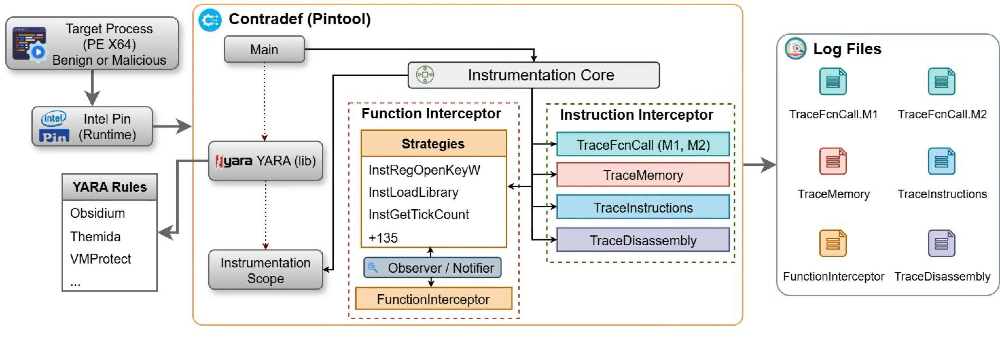

# **Contradef — A Dynamic Binary Instrumentation Tool for Evasive Malware Analysis**

**Contradef** is a Dynamic Binary Instrumentation (DBI) tool — implemented on top of Intel Pin — dedicated to the investigation of evasive malware in Windows x64 executables.

## Abstract

Contradef is a DBI tool, developed on top of Intel Pin, for the analysis of evasive software through *tracing* techniques. It records, into files, the instruction flow, memory accesses, API calls, and other internal states, allowing these data to be investigated after execution.
In this way, analyzing these records makes it possible to reveal obfuscation and evasion techniques employed by software packers such as VMProtect.

---

## Table of Contents

* [1. README.md Structure](#1-readmemd-structure)

  * [1.1 README.md Organization](#11-readmemd-organization)
  * [1.2 Distributed Artifacts](#12-distributed-artifacts)
  * [1.3 Repository Structure](#13-repository-structure)
* [2. Considered Badges](#2-considered-badges)
* [3. Basic Information](#3-basic-information)

  * [3.1 Introduction to Tool Execution and Experiments](#31-introduction-to-tool-execution-and-experiments)
  * [3.2 Main Features](#32-main-features-of-contradef)
  * [3.3 Architecture](#33-tool-architecture)
  * [3.4 How Execution Is Structured](#34-how-execution-is-structured)
  * [3.5 Recommended Environment](#35-recommended-execution-environment)
* [4. Dependencies](#4-dependencies)

  * [4.1 Execution (host)](#41-execution-host)
  * [4.2 Compilation (host)](#42-compilation-dependencies-host-windows)
  * [4.3 VM Creation](#43-vm-creation-dependencies)
  * [4.4 Execution (guest)](#44-execution-dependencies-inside-the-windows-vm)
* [5. Security Concerns](#5-security-concerns)

  * [5.1 Main Risk Vectors](#51-main-risk-vectors)
  * [5.2 Mandatory Measures](#52-mandatory-measures)
  * [5.3 Disclaimer](#53-disclaimer)
* [6. Installation](#6-installation)

  * [6.1 Compilation Procedure](#61-compilation-procedure-optional)

    * [6.1.1 Obtain the Source Code](#611-obtain-the-source-code)
    * [6.1.2 Install Dependencies](#612-install-dependencies)
    * [6.1.3 Compile](#613-compile)
  * [6.2 Execution](#62-execution)

    * [6.2.1 Common Parameters](#621-common-parameters)
    * [6.2.2 Basic Syntax](#622-basic-syntax)
* [7. Minimal Test](#7-minimal-test)

  * [7.1 Prerequisites](#71-prerequisites)
  * [7.2 Step by Step](#72-step-by-step)
* [8. Experiments](#8-experiments)

  * [8.1 Preparing the Environment](#81-preparing-the-experiment-environment)

    * [8.1.1 Install VirtualBox](#811-install-virtualbox)
    * [8.1.2 Download the Windows ISO](#812-download-the-windows-iso-image)
    * [8.1.3 Create the VM](#813-create-the-vm-in-virtualbox)
    * [8.1.4 Install Windows](#814-install-windows-inside-the-vm)
    * [8.1.5 Clean Snapshot](#815-create-a-clean-vm-snapshot)
    * [8.1.6 Guest Adjustments](#816-adjustments-in-the-windows-guest-vm)
  * [8.2 Reproducing the Experiments](#82-reproducing-the-experiments)

    * [8.2.1 Preparation](#821-preparation)
    * [8.2.2 Execution Terminal](#822-execution-terminal)
    * [8.2.3 Time Measurement](#823-time-measurement-optional)
    * [8.2.4 Running Sample 1](#824-running-sample-1-vmprotect)
    * [8.2.5 Running Sample 2](#825-running-sample-2-evasive-behavior)
    * [8.2.6 Running Sample 3](#826-running-sample-3)
    * [8.2.7 Performance Notes](#827-performance-notes)
  * [8.3 Inspecting Results](#83-inspecting-results)

    * [8.3.1 Accessing Logs](#831-accessing-execution-logs)
    * [8.3.2 Opening and Inspecting Logs](#832-opening-and-inspecting-the-logs)
* [9. License](#9-license)

---

# 1. README.md Structure

## 1.1. README.md Organization

**This README.md is organized into the following main sections:**

1. **README.md Structure** – overview of how the document and repository are organized.
2. **Considered Badges** – artifact badges and criteria the project aims to satisfy.
3. **Basic Information** – introduction to the experiments, Contradef features, architecture, and recommended environment.
4. **Dependencies** – hardware/software requirements to compile, create the VM, and run the tool.
5. **Security Concerns** – best practices and checklist to ensure isolation and avoid contamination.
6. **Installation** – compilation procedures (optional) and basic pintool execution.
7. **Minimal Test** – quick step-by-step using a benign executable (7-Zip) to validate the installation.
8. **Experiments** – detailed environment preparation, sample execution, and log collection/analysis.
9. **License** – terms of use and distribution for the source code and artifacts.

## 1.2. Distributed artifacts in this repository

* Source code of **Contradef**.
* A compiled and ready-to-use version of **Contradef (`contradef.dll`)**.
* Configuration guides for the experiment environment, ensuring a safe and reproducible setup.
* Automation scripts for configuring the experiment environment inside the isolated environment (VM).
* Three compressed malware samples for experiment execution.
* Source code of the **YARA** library for integration with **Contradef**.

## 1.3. Repository structure

```text
Contradef/                              ← Main repository directory. It may be named *Contradef-main* when downloaded as a .zip and extracted with the same name
├── Experiment_Environment              ← Prepared environment with artifacts to run the experiments
|   ├── Samples/                        ← Contains real compressed malware samples
|   ├── ContradefDll/                   ← Precompiled Contradef DLL (x64/Debug)
├── Contradef/                          ← Source code (.cpp/.h)
├── docs/                               ← Resources for README.md and configuration tutorials
├── pin/                                ← Extracted Intel Pin 3.28
├── Article_Experiment_Results/         ← Experiment results from the article
├── Scripts/                            ← Quick configuration scripts for the experiment environment inside the VM
├── yara/                               ← YARA 4.5.2 (includes the library)
└── yaracontradef/                      ← Implementation for integrating the YARA library with Contradef
```

> ⚠️ **Important:** The repository name may be *Contradef-main* instead of *Contradef* when downloaded as a .zip and extracted with the same name (*Contradef-main*).

The main goal of the artifacts is to allow evaluators to:

1. Explore the **Contradef** source code.
2. Verify the **functionality** of **Contradef** (minimal test).
3. Reproduce the **full experiments** described in the article, observing the generation of instruction, memory, and API call traces and their correlations.
4. Evaluate the **overhead** and robustness of Contradef against evasive malware.

---

# 2. Considered Badges

The considered badges are: Available, Functional, Sustainable, and Reproducible.

---

# 3. Basic Information

## 3.1 Introduction to tool execution and experiments

**Contradef** is a *pintool* built on top of Intel Pin that injects
runtime hooks to record instructions, memory accesses, and API calls in
Windows x64 executables.

The experiments in this repository have two main purposes:

1. **Validate functionalities** – demonstrate that each module
   (`InterceptFunctions`, `TraceFcn`, `TraceMem`, `TraceInstr`,
   `TraceDasm`) works both independently **and** together, generating
   consistent *logs*.
2. **Evaluate impact** – measure execution time and trace volume while
   instrumenting **real malware samples**.

In the experiments, Contradef is executed inside an offline Windows x64 virtual machine, always starting from a clean snapshot. Initially, each tool module is activated individually over reference executables, and then the pintool is applied with all modules simultaneously to produce a complete *trace*, while execution time and log file sizes are collected to evaluate overhead. At the end, the generated records are inspected in an editor capable of handling very large text files (EmEditor), allowing confirmation of the capture of instructions, API parameters, and memory accesses, as well as observation of how the binary protections manifest at each stage of the analysis.

> ⚠️ **Isolated and controlled environment**
> All tests are executed **inside a VM**, restored from a clean snapshot after each sample, avoiding host contamination and ensuring reproducibility.

> 💡 **Use with benign binaries**
> For debugging, reverse engineering, or packer analysis on legitimate executables, Contradef can run directly on the host without a VM or antivirus deactivation — simply call Pin + Contradef through PowerShell and point to the benign binary.

## 3.2. Main features of Contradef

* **FunctionInterceptor** (`Contradef/FunctionInterceptor.cpp`) — selective *hooking* of more than 100 sensitive APIs (e.g., `GetProcAddress`, `VirtualProtect`, `NtQueryInformationProcess`), recording parameters and return values.
* **TraceFcnCall** (`Contradef/TraceFcnCall.cpp`) — two complementary methods to record calls:

  1. conventional `call` instructions;
  2. indirect jumps resolved at runtime (`GetProcAddress`, `LoadLibrary`, etc.).
     The combination is necessary because protected malware alternates between both schemes to hide critical APIs.
* **TraceMemory** (`Contradef/TraceMemory.cpp`) — logging of reads/writes (up to 16 bytes) with automatic detection of ASCII/Unicode strings, RW → RX transition alerts (indicating unpacking), and display of decoded data (C2 URLs, keys, window names, etc.).
* **TraceInstructions** (`Contradef/TraceInstructions.cpp`) — sequential record of each executed instruction, register values, flags, and immediate operands; essential to reconstruct the flow in obfuscated binaries.
* **TraceDisassembly** (`Contradef/TraceDisassembly.cpp`) — generates a continuous report of the program instructions already translated into symbolic assembly, with resolved addresses and operands.
* **Optional static analysis with YARA** (`Contradef/YaraContradef.cpp`) — the `-yara <rules.yar>` parameter points to a rules file; prior detections may **automatically adjust the scope** of the modules (e.g., enabling only hooks of interest in UPX, VMProtect, etc. binaries).
  *This feature was not required during the experiments.*

> *Contradef modules are **complementary**: memory data can be correlated with the timeline of calls and the exact instruction flow.*

> *Currently, the tool supports **only native 64-bit PE executables**; there is no direct support for .NET, Java, or scripts.*

## 3.3. Tool architecture

<p align="center">
  
</p>

| Component                                                             | Summary of function                                                                                                                                                                          | Source file or folder                                                                                                  |
| --------------------------------------------------------------------- | -------------------------------------------------------------------------------------------------------------------------------------------------------------------------------------------- | ---------------------------------------------------------------------------------------------------------------------- |
| **Instrumentation**                                                   | Core that injects runtime *callbacks* and dispatches events to specialized modules.                                                                                                          | Contradef/TraceMemory.cpp                                                                                              |
| **TraceMemory / TraceInstructions / TraceFcnCall / TraceDisassembly** | Collection modules responsible, respectively, for memory accesses, executed instructions, function calls, and disassembled code fragments. All write results into independent **log files**. | Contradef/TraceFcnCall.cpp, Contradef/TraceMemory.cpp, Contradef/TraceInstructions.cpp, Contradef/TraceDisassembly.cpp |
| **FunctionInterceptor**                                               | Implements selective *hooking* of sensitive APIs, redirecting parameters and return values to the corresponding log file.                                                                    | Contradef/FunctionInterceptor.cpp                                                                                      |
| **Instrumentation Strategy + Strategies**                             | Set of instrumentation rules that can be enabled or swapped at runtime (e.g., intercept only `GetWindowTextA`, `GetWriteWatch`, etc.).                                                       | Contradef/FunctionInterceptor.cpp, Contradef/Inst*.cpp                                                                 |
| **Yara Lib**                                                          | Optional integration to scan the binary before execution; detections may define which strategies or modules will be enabled.                                                                 | Contradef/YaraContradef.cpp, yara/*, yaracontradef/*                                                                   |
| **Notifier → Observer**                                               | Implements the *publish/subscribe* pattern, allowing strategies to generate events that will be recorded in the logs.                                                                        | Notifier.h, Observer.h                                                                                                 |
| **Log files**                                                         | Convergence point for traces; each module writes to its own file, facilitating later correlation.                                                                                            | -                                                                                                                      |

> *The modular nature of Contradef allows enabling only the necessary blocks without recompiling the rest of the tool.*

## 3.4. How execution is structured

1. **Isolated environment** – All tests take place inside an offline
   Windows 10/11 VM starting from a clean snapshot.
   This ensures security and reproducibility.
2. **Execution flow inside the VM**

   1. Restore snapshot and disconnect the network.
   2. Extract the sample (`*.zip`).
   3. Run Pin + Contradef with the desired parameters.
   4. Move the logs to the corresponding result folders.
   5. Inspect the logs or extract the result folders from the VM.
   6. Restore the snapshot before the next sample.
3. **Result inspection**
   Files named `contradef.<PID>.*.cdf` are plain text and can be inspected directly inside the VM or extracted for analysis on the host. **EmEditor** is recommended for logs larger than 2 GB.

By completing the experimentation workflow, the evaluator will have:

* A **clean snapshot** before instrumentation.
* Folders such as **Sample-X-Results** containing the generated CDFs.
* Time metrics via `Measure-Command`.

The detailed execution steps are explained later.

## 3.5. Recommended execution environment

To run the experiments, we suggest the following configuration:

| Layer               | Recommended specification                                                                                          |
| ------------------- | ------------------------------------------------------------------------------------------------------------------ |
| **Host machine**    | • Multi-core CPU with VT-x/AMD-V enabled<br>• **RAM:** ≥ 16 GB<br>• **Storage:** SSD NVMe ≥ 500 GB                 |
| **Hypervisor**      | Oracle **VirtualBox 7.0** (or later)                                                                               |
| **Virtual machine** | • **Guest OS:** Windows 10/11 x64<br>• **vCPU:** ≥ 4 dedicated cores<br>• **RAM:** 6–8 GB<br>• **Disk:** 80–200 GB |

> **Why VirtualBox?** Robust support for snapshots and VT-x/AMD-V, plus compatibility with Intel Pin.

> ⚠️ **Important:** if you only want to run the experiments, the precompiled **Contradef** DLL
> is located at **`Experiment_Environment\ContradefDll\contradef.dll`**.
> Compile only if you wish to modify the source code.

---

# 4. Dependencies

The list below covers the **entire cycle** — from host compilation to
test execution inside the VM — indicating minimum versions and official links.

## 4.1. Dependency for execution

* **Intel Pin** 3.28 (x64, MSVC), available at [https://software.intel.com/sites/landingpage/pintool/downloads/pin-3.28-98749-g6643ecee5-msvc-windows.zip](https://software.intel.com/sites/landingpage/pintool/downloads/pin-3.28-98749-g6643ecee5-msvc-windows.zip).

## 4.2. Compilation dependencies (Windows host)

> ⚠️ **Compilation is not required** to reproduce the experiments:
> the ready-to-use binary is in **`Experiment_Environment\ContradefDll`** in the repository.
> Compile only if you want to modify the source code.

| Tool                             | Minimum version  | Notes                                                                                                                                                                                                                                                                                                                                   |
| -------------------------------- | ---------------- | --------------------------------------------------------------------------------------------------------------------------------------------------------------------------------------------------------------------------------------------------------------------------------------------------------------------------------------- |
| **Visual Studio 2019** (or 2022) | Community/Pro    | Download from [https://visualstudio.microsoft.com/pt-br/vs/older-downloads/](https://visualstudio.microsoft.com/pt-br/vs/older-downloads/). Install the *Desktop C++ Workload*. In VS 2022, also install **toolset v142** to maintain Pin compatibility.                                                                                |
| **Windows 10 SDK**               | 10.0.19041.0     | Included in the VS installer.                                                                                                                                                                                                                                                                                                           |
| **Intel Pin**                    | 3.28 (x64, MSVC) | Download from [https://software.intel.com/sites/landingpage/pintool/downloads/pin-3.28-98749-g6643ecee5-msvc-windows.zip](https://software.intel.com/sites/landingpage/pintool/downloads/pin-3.28-98749-g6643ecee5-msvc-windows.zip) and extract into `pin\` (move **only** the contents, avoiding the generated extraction subfolder). |
| **YARA** *(already included)*    | 4.5.2            | Already provided in `yara\` in this repository (under BSD 3-Clause license).                                                                                                                                                                                                                                                            |

## 4.3. Dependencies for VM creation

| Tool                      | Function                                                                     | Link                                                       |
| ------------------------- | ---------------------------------------------------------------------------- | ---------------------------------------------------------- |
| **Oracle VirtualBox 7.x** | Hypervisor used in the tutorials, facilitates snapshots and Guest Additions. | [https://www.virtualbox.org/](https://www.virtualbox.org/) |

## 4.4. Execution dependencies inside the Windows VM

| Requirement           | Reason / Notes                                                                                                                    |
| --------------------- | --------------------------------------------------------------------------------------------------------------------------------- |
| **Windows 10/11 x64** | Isolated guest system for analysis.                                                                                               |
| **Pin 3.28**          | Required to run the experiments.                                                                                                  |
| **`contradef.dll`**   | Use the DLL compiled on the host (must be transferred) **or** the ready-to-use version in `Experiment_Environment\ContradefDll\`. |

Auxiliary tools (inside the VM):

| Tool                           | Purpose                                               | Link                                                                       |
| ------------------------------ | ----------------------------------------------------- | -------------------------------------------------------------------------- |
| **7-Zip**                      | Extract samples protected with a password.            | [https://www.7-zip.org/download.html](https://www.7-zip.org/download.html) |
| **EmEditor**                   | Open `.cdf` *logs* larger than 2 GB without freezing. | [https://www.emeditor.com/](https://www.emeditor.com/)                     |
| **VirtualBox Guest Additions** | Enable shared folders (optional).                     | Included in the VirtualBox ISO                                             |

---

# 5. Security Concerns

The Contradef tool **does not contain malicious code** — it is a C/C++ *pintool*
that only collects and writes *logs*.
**The real risk comes from the malware samples that will be executed** to
test the tool.

## 5.1. Main risk vectors

| Vector                         | Description                                                           |
| ------------------------------ | --------------------------------------------------------------------- |
| **Sample execution**           | If the malware escapes the VM, it may infect the host.                |
| **Network**                    | Many malware samples attempt to download payloads or exfiltrate data. |
| **Shared folders / Clipboard** | Escape channel to copy malicious files to the host.                   |

To protect artifact evaluators (reviewers or readers of the repository),
follow the guidelines below.

## 5.2. Mandatory measures

1. **Do not run the experiments on the host system**

   * The entire experiment must remain confined to the VM; nothing should be executed directly on the physical system.
2. **Dedicated VM, no network access during execution**

   * VirtualBox → **Settings > Network > Attached to > Not attached**.
3. **Snapshots**

   * Use a clean snapshot.
   * Restore it **after each sample execution**.
4. **Shared folders and VM clipboard**

   * Disable them while the malware is running.
   * Enable them only to copy *logs* **before** restoring the snapshot.
5. **Samples provided for the experiment**

   * The provided samples are located in the `Experiment_Environment\Samples` folder
     of the repository and are password-protected and named with their respective hashes.
6. **Text-only logs**

   * The `*.cdf` files are plain text — they do not contain executable code.

## 5.3. Disclaimer

The project provides samples **exclusively for academic purposes** and
assumes the evaluator is aware of the legal and technical implications of
executing malicious software.
**The authors are not responsible** for damages resulting from improper
use or use outside a controlled environment.

---

# 6. Installation

## 6.1. Compilation procedure (optional)

> ⚠️ **Important:** if you only want to run the experiments, the precompiled DLL
> is located at **`Experiment_Environment\ContradefDll\contradef.dll`**.
> Compile only if you wish to modify the source code.

### 6.1.1. Obtain the source code

Download the repository .zip file and extract it, or clone it using Git:

```bash
git clone https://github.com/contradef/Contradef.git
cd Contradef
```

### 6.1.2. Install dependencies

1. **Visual Studio 2019** (or 2022)
   *Workload → Desktop development with C++*

   * **toolset v142** (mandatory even in VS 2022).
2. **Windows 10 SDK ≥ 10.0.19041.0**
3. **Intel Pin 3.28 (x64)**
   *Download and extract it; copy the folder contents to `pin\` in the repository.*

> ⚠️ **Attention:** Use only the **MSVC** version of Intel Pin; Contradef is not compatible with the **Clang**-based build.
> After downloading Pin 3.28, extract the package and move **only** the contents (directories such as *ia32*, *intel64*, *extras*, *doc*, the `pin.exe` executable, etc.) into the `pin\` folder in the repository, avoiding the generated extraction subfolder.

```text
pin/
├── doc/
├── extras/
├── ia32/
├── intel64/
├── pin.exe
└── … (other directories)
```

### 6.1.3. Compile

1. Open **`Contradef.sln`** in Visual Studio.
   *When VS 2022 asks whether to “upgrade the toolset”, choose **No**. Keep **Visual Studio 2019 (v142)** to ensure compatibility with Pin.*
2. Select **Configuration → Debug** and **Platform → x64**.
3. Build (**Ctrl + Shift + B**).

The resulting file will be generated at:

```text
x64\Debug\contradef.dll
```

Copy it to the VM or replace the existing DLL in `Experiment_Environment\ContradefDll\` in the repository folder before running the tests.

---

## 6.2. Execution

### 6.2.1. Common parameters

| Parameter        | Description                                          |
| ---------------- | ---------------------------------------------------- |
| `-intercept_fcn` | Enables **FunctionInterceptor**                      |
| `-trace_exfcn`   | Enables **TraceFcnCall**                             |
| `-trace_mem`     | Enables **TraceMemory**                              |
| `-trace_instr`   | Enables **TraceInstructions**                        |
| `-trace_dasm`    | Enables **TraceDisassembly**                         |
| `-yara <file>`   | Applies YARA rules before instrumentation (optional) |

### 6.2.2. Basic syntax

> ⚠️ **Attention:** Replace the placeholders (`PATH_PIN_x64`, `PATH_CONTRADEF`) and the target program path with the actual artifact paths.

```powershell
<PATH_PIN_x64>\pin.exe -t <PATH_CONTRADEF>\contradef.dll -intercept_fcn -trace_exfcn -trace_mem -trace_instr -trace_dasm -- C:\Samples\target.exe
```

*Log files are written to the terminal’s current working directory.*

---

# 7. Minimal Test

> This **quick test** shows that the pintool is functional without requiring
> malware samples or antivirus deactivation.
> It runs directly on the host (Windows x64) using the command-line executable
> **`7za.exe`** from the portable **7-Zip** package.

## 7.1. Prerequisites

* Windows 10/11 **64-bit** host.
* The **`Experiment_Environment`** folder from the Contradef repository containing:

```text
pin\                        ← Extracted Intel Pin 3.28
Experiment_Environment
├── ContradefDll\           ← Ready-to-use precompiled contradef.dll
└── 7za.exe                 ← Portable 7-Zip CLI executable (x64)
```

## 7.2. Step by step

1. Download and extract 7-Zip Extra (portable CLI)

* Visit:
  [https://www.7-zip.org/download.html](https://www.7-zip.org/download.html)

* Download the standalone package:
  [7z2409-extra.7z (x64)](https://www.7-zip.org/a/7z2409-extra.7z)

* Extract and copy the executable:
  `x64\7za.exe → Experiment_Environment\`

2. Open PowerShell

3. Go to the repository test directory (`Experiment_Environment`)

> *Example below. Replace it with the actual path on your PC.*

```powershell
cd "C:\Users\user\Downloads\Contradef-main\Experiment_Environment"
```

4. Run Contradef with a lightweight module

```powershell
..\pin\intel64\bin\pin.exe -t .\ContradefDll\contradef.dll -intercept_fcn -- .\7za.exe
```

> The `-intercept_fcn` parameter enables only **FunctionInterceptor**, generating a small log.

5. Check the output

After execution finishes, you should see a file with a name similar to:

```text
contradef.<PID>.FunctionInterceptor.cdf
```

Open it with **Notepad**, **VS Code**, or **EmEditor** to inspect the intercepted API calls.

6. Run Contradef with all modules enabled (optional)

```powershell
..\pin\intel64\bin\pin.exe -t .\ContradefDll\contradef.dll -intercept_fcn -trace_exfcn -trace_mem -trace_instr -trace_dasm -- .\7za.exe
```

This allows you to confirm that the pintool is operating correctly before moving on to isolated-environment tests.

---

# 8. Experiments

## 8.1. Preparing the Experiment Environment

### 8.1.1. Install VirtualBox

1. Go to [https://www.virtualbox.org/](https://www.virtualbox.org/)
2. Click **Download VirtualBox** for your operating system.
3. Run the installer using the default options.

### 8.1.2. Download the Windows ISO image

* **Windows 10 Enterprise x64** evaluation ISO
  [https://go.microsoft.com/fwlink/p/?LinkID=2208844&clcid=0x416&culture=pt-br&country=BR](https://go.microsoft.com/fwlink/p/?LinkID=2208844&clcid=0x416&culture=pt-br&country=BR)

* Other options (including Windows 11):
  [https://www.microsoft.com/en-us/evalcenter/download-windows-10-enterprise](https://www.microsoft.com/en-us/evalcenter/download-windows-10-enterprise)

### 8.1.3. Create the VM in VirtualBox

1. **Machine → New** → select *Windows 10/11 x64*.
2. Allocate **4–8 GB of RAM**, **4–6 vCPUs**, and **80–200 GB** of disk (VDI).

### 8.1.4. Install Windows inside the VM

1. Select the ISO as boot media.
2. Follow the installation wizard normally and configure language and partition.
3. Wait until the Windows installation step is complete; the VM will restart automatically. If it does not, restart it manually.
4. After installation, continue through the setup wizard until the “Sign in with Microsoft account” screen, type any fake address such as **[user@user.com](mailto:user@user.com)**, and click **Next**.
5. The installer will show the **Set up Windows with a local account** link; click it to proceed without a Microsoft account.
6. Enter the local username **analyst** and click **Next**.
7. Leave the password blank for the local user and click **Next**.
8. Complete the installation wizard.

### 8.1.5. Create a clean VM snapshot

* In VirtualBox, open the **Snapshots** tab → **Take** → name it **Clean Environment**.

### 8.1.6. Adjustments inside the Windows guest (VM)

1. **Install Guest Additions** (optional for shared folders).
2. **Download and extract Contradef** (GitHub ZIP).
   Extract the file into `C:\Users\analyst\Experiment`, so the main repository directory becomes `C:\Users\analyst\Experiment\Contradef-main`.
   *After extraction, the default repository folder name will be `Contradef-main`.*
3. Download and extract Pin from [https://software.intel.com/sites/landingpage/pintool/downloads/pin-3.28-98749-g6643ecee5-msvc-windows.zip](https://software.intel.com/sites/landingpage/pintool/downloads/pin-3.28-98749-g6643ecee5-msvc-windows.zip)
4. Copy the extracted contents to the `pin\` folder inside the repository.

> ⚠️ **Attention:** Use only the **MSVC** version of Intel Pin; Contradef is not compatible with the **Clang**-based build.
> After downloading Pin 3.28, extract the package and move **only** the contents (directories such as *ia32*, *intel64*, *extras*, *doc*, the `pin.exe` executable, etc.) into the `pin\` folder in the repository, avoiding the extraction-generated subfolder.

```text
pin/
├── doc/
├── extras/
├── ia32/
├── intel64/
├── pin.exe
└── … (other directories)
```

5. **Disable “Tamper Protection”**
   *Settings → Update & Security → Windows Security → Virus & threat protection → Manage settings → Tamper Protection* → **Disable**.
6. **Open the main repository folder**:

```powershell
cd "C:\Users\analyst\Experiment\Contradef-main"
```

7. **Run the Defender and UAC disable script**:

```text
.\Scripts\disable_defender_uac.bat  (run as Administrator)
```

After running the script, **restart the VM** when prompted.

8. **Create a “Base-Tools” snapshot** to preserve this state before starting real tests.

## 8.2. Reproducing the experiments

Below we present a minimal workflow to reproduce the experiments described in the article.

> ## ⚠️ **Important:**
>
> * Execute each step below **only inside the analysis VM** to avoid compromising the host.
> * All commands assume the **`Experiment_Environment`** directory in the repository, for example: `C:\Users\analyst\Experiment\Contradef-main\Experiment_Environment`.

### 8.2.1. Preparation

1. **Install 7-Zip**
   [https://www.7-zip.org/a/7z2409-x64.exe](https://www.7-zip.org/a/7z2409-x64.exe)
2. Extract the files `Experiment_Environment\Samples\*.zip` into the **same folder** using the password `infected`.
3. **Disable the VM network** before running any sample with Contradef.

#### Expected folder structure

```text
Contradef-main                  → main repository directory
├── pin\                        → original Pin 3.28 binaries
└── Experiment_Environment\
    ├── ContradefDll\           → precompiled contradef.dll
    └── Samples\                → compressed samples
        ├── 36685efcf34c7a7a6f6dd2e48199e4700b5ab8fe3945a50297703dd8daced74f.zip
        ├── 0f20b0c906f3ad95dbf75ed526b2fe4341fdf62ab8c971fc10e340091af75b3b.zip
        └── 430b487c0bc9b53382537422209acbd1c6ae63773cacf0c9f7d61f23e7fa8485.zip
```

After extraction:

```text
Contradef-main\Experiment_Environment\Samples\
├── 36685efcf34c7a7a6f6dd2e48199e4700b5ab8fe3945a50297703dd8daced74f.exe
├── 0f20b0c906f3ad95dbf75ed526b2fe4341fdf62ab8c971fc10e340091af75b3b.exe
└── 430b487c0bc9b53382537422209acbd1c6ae63773cacf0c9f7d61f23e7fa8485.exe
```

### 8.2.2. Execution terminal

**Open PowerShell as Administrator** (`Start → type “powershell” → right-click → Run as administrator`).

```powershell
cd "C:\Users\analyst\Experiment\Contradef-main\Experiment_Environment"
```

> *Tip:* use quotes if the path contains spaces.

* All **logs** will be saved in the current working directory (`Experiment_Environment`). If you want to separate executions, create a subfolder before running the commands, change into it, and provide absolute paths to `pin.exe`, `contradef.dll`, and the sample.
* ⚠️ **Restore the clean snapshot** after each analysis to avoid cross-contamination between samples.

### 8.2.3. Time measurement (optional)

Use `Measure-Command` to time Pin/Contradef execution, for example:

```powershell
# Example of time measurement with Measure-Command
Measure-Command { ..\pin\intel64\bin\pin.exe -t .\ContradefDll\contradef.dll -trace_exfcn -- .\Samples\36685efcf34c7a7a6f6dd2e48199e4700b5ab8fe3945a50297703dd8daced74f.exe }
```

### 8.2.4. Running Sample 1

#### 8.2.4.1. Individual modules

* FunctionInterceptor:

```powershell
Measure-Command { ..\pin\intel64\bin\pin.exe -t .\ContradefDll\contradef.dll -intercept_fcn -- .\Samples\36685efcf34c7a7a6f6dd2e48199e4700b5ab8fe3945a50297703dd8daced74f.exe }
```

* TraceFcnCall:

```powershell
Measure-Command { ..\pin\intel64\bin\pin.exe -t .\ContradefDll\contradef.dll -trace_exfcn -- .\Samples\36685efcf34c7a7a6f6dd2e48199e4700b5ab8fe3945a50297703dd8daced74f.exe }
```

* TraceMemory:

```powershell
Measure-Command { ..\pin\intel64\bin\pin.exe -t .\ContradefDll\contradef.dll -trace_mem -- .\Samples\36685efcf34c7a7a6f6dd2e48199e4700b5ab8fe3945a50297703dd8daced74f.exe }
```

* TraceInstructions:

```powershell
Measure-Command { ..\pin\intel64\bin\pin.exe -t .\ContradefDll\contradef.dll -trace_instr -- .\Samples\36685efcf34c7a7a6f6dd2e48199e4700b5ab8fe3945a50297703dd8daced74f.exe }
```

* TraceDisassembly:

```powershell
Measure-Command { ..\pin\intel64\bin\pin.exe -t .\ContradefDll\contradef.dll -trace_dasm -- .\Samples\36685efcf34c7a7a6f6dd2e48199e4700b5ab8fe3945a50297703dd8daced74f.exe }
```

#### 8.2.4.2. Save the sample results

1. Create a folder, for example **Sample-1-Results**, inside `Experiment_Environment`.
2. Move all newly generated `.cdf` files into that folder.

#### 8.2.4.3. Full execution (all modules)

```powershell
Measure-Command { ..\pin\intel64\bin\pin.exe -t .\ContradefDll\contradef.dll -intercept_fcn -trace_exfcn -trace_mem -trace_instr -trace_dasm -- .\Samples\36685efcf34c7a7a6f6dd2e48199e4700b5ab8fe3945a50297703dd8daced74f.exe }
```

Then move the `.cdf` files into a dedicated folder such as **Full-Execution-Sample-1**.

### 8.2.5. Running Sample 2

#### 8.2.5.1. Individual modules

* FunctionInterceptor:

```powershell
Measure-Command { ..\pin\intel64\bin\pin.exe -t .\ContradefDll\contradef.dll -intercept_fcn -- .\Samples\0f20b0c906f3ad95dbf75ed526b2fe4341fdf62ab8c971fc10e340091af75b3b.exe }
```

* TraceFcnCall:

```powershell
Measure-Command { ..\pin\intel64\bin\pin.exe -t .\ContradefDll\contradef.dll -trace_exfcn -- .\Samples\0f20b0c906f3ad95dbf75ed526b2fe4341fdf62ab8c971fc10e340091af75b3b.exe }
```

* TraceMemory:

```powershell
Measure-Command { ..\pin\intel64\bin\pin.exe -t .\ContradefDll\contradef.dll -trace_mem -- .\Samples\0f20b0c906f3ad95dbf75ed526b2fe4341fdf62ab8c971fc10e340091af75b3b.exe }
```

* TraceInstructions:

```powershell
Measure-Command { ..\pin\intel64\bin\pin.exe -t .\ContradefDll\contradef.dll -trace_instr -- .\Samples\0f20b0c906f3ad95dbf75ed526b2fe4341fdf62ab8c971fc10e340091af75b3b.exe }
```

* TraceDisassembly:

```powershell
Measure-Command { ..\pin\intel64\bin\pin.exe -t .\ContradefDll\contradef.dll -trace_dasm -- .\Samples\0f20b0c906f3ad95dbf75ed526b2fe4341fdf62ab8c971fc10e340091af75b3b.exe }
```

#### 8.2.5.2. Save the sample results

1. Create a folder, for example **Sample-2-Results**, inside `Experiment_Environment`.
2. Move all newly generated `.cdf` files into that folder.

#### 8.2.5.3. Full execution (all modules)

```powershell
Measure-Command { ..\pin\intel64\bin\pin.exe -t .\ContradefDll\contradef.dll -intercept_fcn -trace_exfcn -trace_mem -trace_instr -trace_dasm -- .\Samples\0f20b0c906f3ad95dbf75ed526b2fe4341fdf62ab8c971fc10e340091af75b3b.exe }
```

Then move the `.cdf` files into a dedicated folder such as **Full-Execution-Sample-2**.


### 8.2.6. Running Sample 3

#### 8.2.6.1. Individual modules

* FunctionInterceptor:

```powershell
Measure-Command { ..\pin\intel64\bin\pin.exe -t .\ContradefDll\contradef.dll -intercept_fcn -- .\Samples\430b487c0bc9b53382537422209acbd1c6ae63773cacf0c9f7d61f23e7fa8485.exe }
```

* TraceFcnCall:

```powershell
Measure-Command { ..\pin\intel64\bin\pin.exe -t .\ContradefDll\contradef.dll -trace_exfcn -- .\Samples\430b487c0bc9b53382537422209acbd1c6ae63773cacf0c9f7d61f23e7fa8485.exe }
```

* TraceMemory:

```powershell
Measure-Command { ..\pin\intel64\bin\pin.exe -t .\ContradefDll\contradef.dll -trace_mem -- .\Samples\430b487c0bc9b53382537422209acbd1c6ae63773cacf0c9f7d61f23e7fa8485.exe }
```

* TraceInstructions:

```powershell
Measure-Command { ..\pin\intel64\bin\pin.exe -t .\ContradefDll\contradef.dll -trace_instr -- .\Samples\430b487c0bc9b53382537422209acbd1c6ae63773cacf0c9f7d61f23e7fa8485.exe }
```

* TraceDisassembly:

```powershell
Measure-Command { ..\pin\intel64\bin\pin.exe -t .\ContradefDll\contradef.dll -trace_dasm -- .\Samples\430b487c0bc9b53382537422209acbd1c6ae63773cacf0c9f7d61f23e7fa8485.exe }
```

#### 8.2.6.2. Save the sample results

1. Create a folder, for example **Sample-3-Results**, inside `Experiment_Environment`.
2. Move all newly generated `.cdf` files into that folder.

#### 8.2.6.3. Full execution (all modules)

```powershell
Measure-Command { ..\pin\intel64\bin\pin.exe -t .\ContradefDll\contradef.dll -intercept_fcn -trace_exfcn -trace_mem -trace_instr -trace_dasm -- .\Samples\430b487c0bc9b53382537422209acbd1c6ae63773cacf0c9f7d61f23e7fa8485.exe }
```

Then move the `.cdf` files into a dedicated folder such as **Full-Execution-Sample-3**.


### 8.2.7. Performance notes

* Measured times may vary depending on the host hardware; results different from those presented in the article are expected on machines with different processing or disk characteristics.
* On **bare-metal** hosts equipped with SSD or NVMe, log generation is much faster, since the main bottleneck of Pin + Contradef is disk writing.
* Logs up to **2 GB** open fine in **VS Code**; above that limit, **EmEditor** or another large-file-oriented tool is recommended.

---

## 8.3. Inspecting results

This section shows how to open the `.cdf` files (generated by instrumentation) and inspect the logs directly inside the VM. If preferred, they can also be transferred to the host system.

Additional experimental results can be found here:
https://drive.google.com/file/d/1-VokSzyy7cvSlnTp_u1J5kHFwImorBPs/view?usp=sharing

### 8.3.1. Accessing execution logs

Once the experiments are complete, the `.cdf` files can be inspected directly inside the VM or transferred to the host for external analysis.

> ⚙️ **Optional** — if you prefer to analyze them on the host, enable **Shared Folders** in VirtualBox and share only the `.cdf` files.

> ⚠️ **Important** – results may vary from one execution to another, even with the same sample:
> • Different internal flows (threads, code paths) generate different event order and quantities.
> • During unpacking or code relocation, memory addresses change and are reflected in the *logs*.
> These differences are expected and do not indicate a failure of the tool or inconsistency in the results.

### 8.3.2. Install EmEditor for large files

1. Go to [https://www.emeditor.com/#download](https://www.emeditor.com/#download).
2. Click **Download Now**, run the installer, and confirm with **Install**.

### 8.3.3. Open and inspect the logs

1. Right-click the `.cdf` file → **Open with → EmEditor**.

   <p align="center"></p>

2. Use EmEditor’s features to explore the trace: keyword search (addresses, APIs, strings), regular expressions, bookmarks, column filtering, etc.

   <p align="center"></p>

Even if two logs from the same sample show slight differences, the essential events — critical API calls, executable memory regions, and key instruction sequences — remain consistent and sufficient to reproduce the conclusions of the article.

---

# 9. License

This project is licensed under the terms of the [MIT License](./LICENSE).

> ⚠️ **Legal Notice:** This project was developed exclusively for educational purposes and information security research. Improper or malicious use, or use in production environments, is the sole responsibility of the user.
> The experiments involve interaction with malicious software samples — always use isolated and controlled environments.

> 📌 The project depends on third-party tools with their own licenses, such as [Intel PIN](https://www.intel.com/content/www/us/en/developer/articles/tool/pin-a-dynamic-binary-instrumentation-tool.html) and [YARA](https://virustotal.github.io/yara/). Please verify and comply with the terms of use of these tools.
