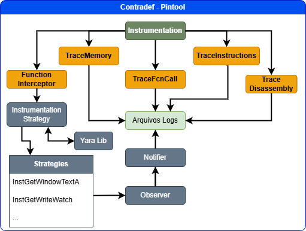

# Contradef – pintool para investigação de executáveis Windows (x64)

Contradef é uma **pintool** construída sobre o Intel Pin com o objetivo principal de analisar _malware_ evasivo em ambiente Windows 64 bits.  
Embora possua contramedidas específicas para técnicas _anti-analysis_ (anti-debug, anti-VM, anti-instrumentation), **também pode ser empregada na análise de qualquer executável legítimo**, sempre que se deseje observar (ou mesmo manipular) o comportamento em tempo de execução com alta granularidade.

---

## 1. Características principais
* **FunctionInterceptor** – _hooking_ seletivo de mais de 100 rotinas sensíveis (ex.: `GetProcAddress`, `VirtualProtect`, `NtQueryInformationProcess`) com registro de parâmetros e valor de retorno.  
* **TraceFcnCall** – dois métodos complementares para registrar chamadas:  
  1. instruções `call` convencionais;  
  2. saltos indiretos usando endereços obtidos em tempo de execução (`GetProcAddress`, `LoadLibrary`, etc.).  
  A combinação é necessária porque _malwares_ protegidos alternam entre os dois esquemas para mascarar APIs críticas.
* **TraceMemory** – log de leituras/escritas (até 16 bytes) com auto-detecção de _strings_ ASCII/Unicode, alerta de transição RW → RX (indício de desempacotamento) e exibição de dados decifrados (URLs C2, chaves, nomes de janelas…).
* **TraceInstructions / TraceDisassembly** – registro sequencial de cada instrução executada, valores de registradores, _flags_ e operandos imediatos; essencial para reconstituir o fluxo em binários ofuscados.
* **Análise estática opcional com YARA** – parâmetro `-yara <regras.yar>` permite apontar um arquivo de regras; detecções prévias servem para **ajustar automaticamente o escopo** dos módulos (ex.: ativar somente _hooks_ de interesse em binários UPX, VMProtect, etc.).

---

## 2. Arquitetura da Ferramenta

<p align="center">
  
</p>

A figura acima resume o fluxo interno da **Contradef**:

| Componente (cor) | Função resumida |
|------------------|-----------------|
| **Instrumentation** <br>*(verde)* | Núcleo que injeta *callbacks* em tempo de execução e despacha eventos para os módulos especializados. |
| **TraceMemory / TraceInstructions / TraceFcnCall / TraceDisassembly** <br>*(laranja)* | Módulos de coleta: registram, respectivamente, acessos à memória, instruções executadas, chamadas de função e trechos desassemblados. Todos gravam resultados em **Arquivos Logs**. |
| **FunctionInterceptor** <br>*(laranja, à esquerda)* | Implementa *hooking* seletivo de APIs sensíveis, redirecionando parâmetros/retornos aos arquivos de log. |
| **Instrumentation Strategy + Strategies** <br>*(azul-claro/azul-escuro)* | Camada de estratégias: regras de instrumentação que podem ser ativadas ou trocadas em tempo de execução (ex.: interceptar apenas `GetWindowTextA`, `GetWriteWatch`, etc.). |
| **Yara Lib** <br>*(cinza-azulado)* | Integração opcional para escanear o binário antes da execução; as detecções definem quais estratégias ou módulos serão habilitados. |
| **Notifier → Observer** <br>*(cinza-médio/escuro)* | Implementa um padrão publicador-assinante, permitindo que rotinas externas sejam notificadas de eventos relevantes (ex.: detecção de *anti-debug*). |
| **Arquivos Logs** <br>*(verde-claro)* | Ponto de convergência de todos os traços; cada módulo escreve em seu próprio arquivo para facilitar a correlação posterior. |

Esse desenho evidencia a natureza modular da Contradef: é possível ativar apenas os blocos necessários—ou adicionar novos—sem recompilar o restante da ferramenta. .


## 3. Ambiente recomendado para testes
> **IMPORTANTE:** sempre execute amostras reais de _malware_ em ambiente isolado.

1. Crie uma VM no **VirtualBox** (snapshot limpo).  
```text
   • SO convidado: Windows 10/11 x64
   • Disco SSD (recomendado)  
   • Desative: Windows Defender e UAC  
   • Execute o CMD/PowerShell como Administrador
````

2. Copie o diretório do Pin (inclui o `pin.exe`), `contradef.dll` e a amostra para um diretório dentro da VM.
3. Após cada análise, **restaure o snapshot** para evitar contaminação cruzada.

---

## 4. Compilação

Contradef funciona no C++ 11 (compatível com a biblioteca STL Port usada no Pin).

```text
Requisitos:
  • Visual Studio 2019 ou 2022
  • Intel Pin 3.28
  • SDK Windows 10
```

> Mesmo abrindo o projeto no VS 2022, **não atualize** o “Conjunto de Ferramentas da Plataforma” – mantenha **Visual Studio 2019 (v142)** para compatibilidade com o Pin.

1. Abra `Contradef.sln`
2. Selecione **x64 / Debug**
3. Compile (`Ctrl + Shift + B`)
4. O binário resultante `contradef.dll` ficará em `bin\x64\Debug\`.

*Uma release está disponível no diretório* `ContradefDll` 

---

## 5. Sintaxe de execução

```powershell
<PATH_PIN>\pin.exe ^
  -t <PATH_CONTRADEF>\contradef.dll ^
  -intercept_fcn -trace_exfcn -trace_mem -trace_instr -trace_dasm ^
  -yara C:\regras\malware.yar ^
  -- C:\Samples\alvo.exe
```

*Os arquivos de log são gravados **no diretório atual do terminal**.
Deseja usar outra pasta? Forneça caminhos absolutos tanto para `pin.exe` quanto para `contradef.dll`.*

---

## 6. Parâmetros mais comuns

| Parâmetro         | Descrição                           |
| ----------------- | -------------------------------------------------------- |
| `-intercept_fcn`  | Ativa o **FunctionInterceptor** (hooking de APIs)        |
| `-trace_exfcn`    | Ativa o **TraceFcnCall**                                 |
| `-trace_mem`      | Ativa o **TraceMemory**                                  |
| `-trace_instr`    | Ativa o **TraceInstructions**                            |
| `-trace_dasm`     | Ativa o **TraceDisassembly**                             |
| `-yara <arquivo>` | Especifica regras YARA a aplicar antes da instrumentação |

*Para logs superiores a 2 GB recomenda-se abrir com o **EmEditor**.*

---

## 7. Observações finais

* Os módulos são **complementares**: dados de memória podem ser correlacionados com a linha temporal de chamadas e com o fluxo exato de instruções.
* O desempenho depende do perfil do alvo; use apenas os traços necessários ou condicione a ativação via detector de sequência.
* A ferramenta atualmente suporta **apenas executáveis PE 64-bit nativos**; não há suporte direto a .NET, Java ou scripts. Contribuições são bem-vindas!