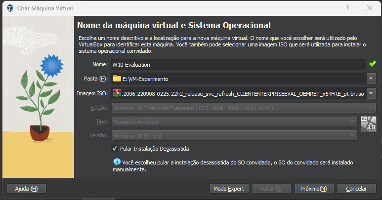
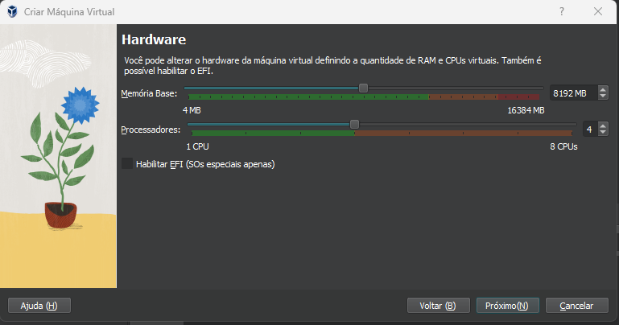
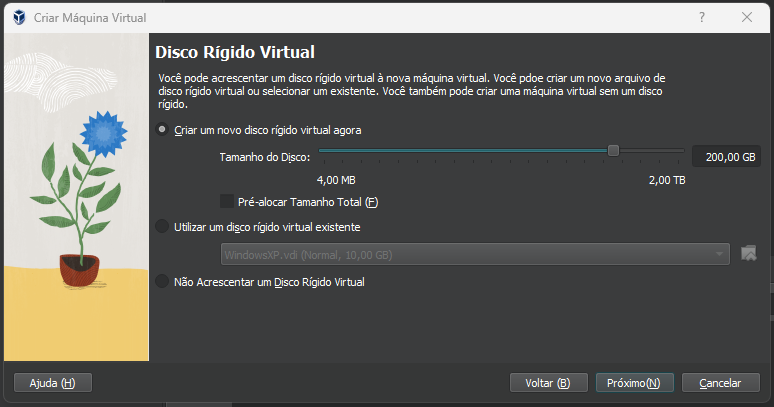
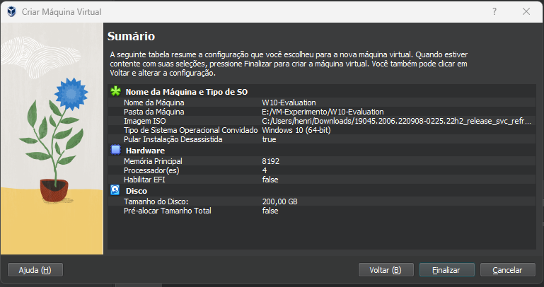
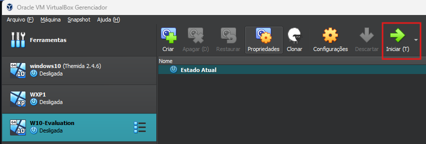

## Criar uma VM no VirtualBox

### Nome da Máquina Virtual e Sistema Operacional

* Abra o **VirtualBox** → **Máquina** → **Novo**.  
* Informe um nome para a VM no campo **Nome**.  
* *(Opcional)* escolha a pasta de destino no campo **Pasta**.  
* Selecione a imagem ISO no campo **Imagem ISO**.  

  

---

### Hardware

* Ajuste os recursos de hardware da VM.  

  

_Recomendado: 4 – 8 GB de RAM e 4 – 6 vCPUs._

---

### Disco Rígido Virtual

* Defina o tamanho do disco virtual.  

  

_Recomendado: 80 – 200 GB (VDI de tamanho fixo)._

---

### Sumário

* Revise as informações e conclua a criação da VM.  

  

---

### Iniciar a VM

* Selecione a VM criada.  
* Clique em **Iniciar**.  

  

[Voltar para a documentação principal](https://github.com/contradef/Contradef?tab=readme-ov-file#4-criar-a-vm-no-virtualbox-ver-detalhes)