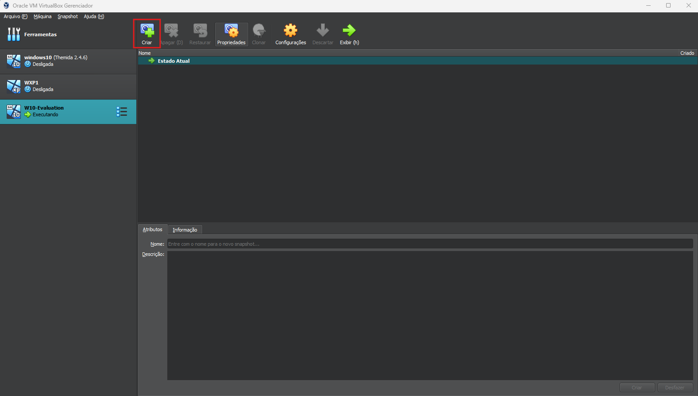
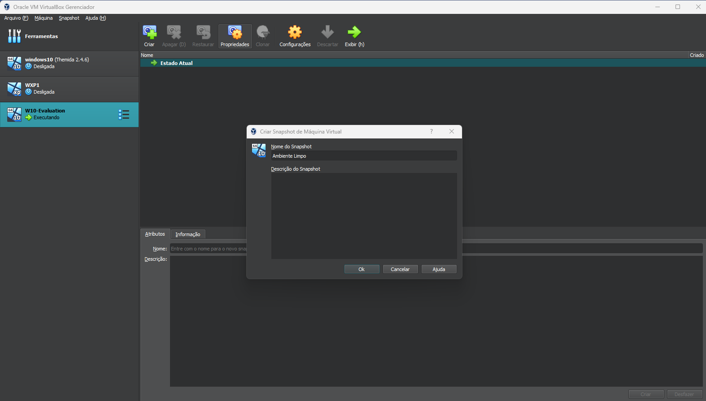
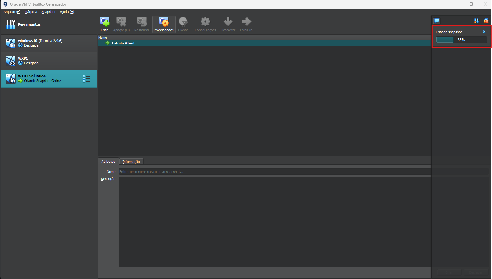

### Criar um snapshot “limpo” no VirtualBox

Snapshot é essencial para restaurar rapidamente o estado da VM antes de cada amostra de *malware*.  
Siga os passos a seguir:

---

#### 1. Abrir a guia *Snapshots*

* Selecione a VM desejada.  
* Clique no ícone **Criar** (ou use *Snapshot → Criar*).

  

---

#### 2. Definir nome e (opcional) descrição

* No campo **Nome do Snapshot**, digite algo como **Ambiente Limpo**.  
* (Opcional) Adicione uma descrição — ex.: “Windows recém-instalado, sem amostras”.  
* Clique em **OK**.

  

---

#### 3. Aguardar a conclusão

* O VirtualBox exibirá a barra de progresso em “Criando snapshot…”.  
* Aguarde até chegar a 100 %.

  

---

> 💡 **Dica:** crie snapshots incrementais antes de cada lote de testes — a restauração é quase instantânea e evita contaminação cruzada entre amostras.

[Voltar para a documentação principal](https://github.com/contradef/Contradef?tab=readme-ov-file#815-criar-snapshot-da-vm-limpa-ver-detalhes)
