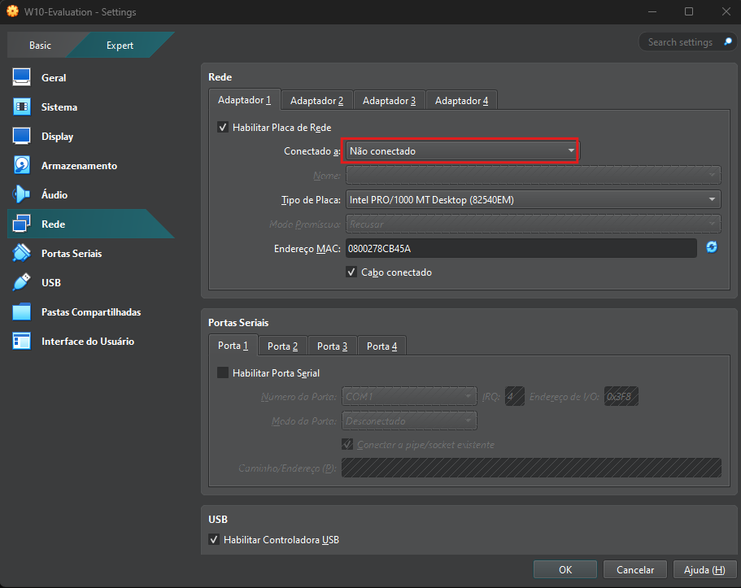
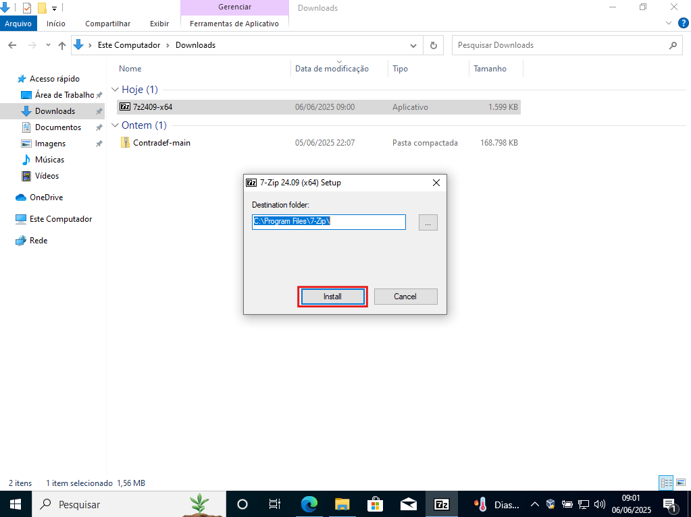
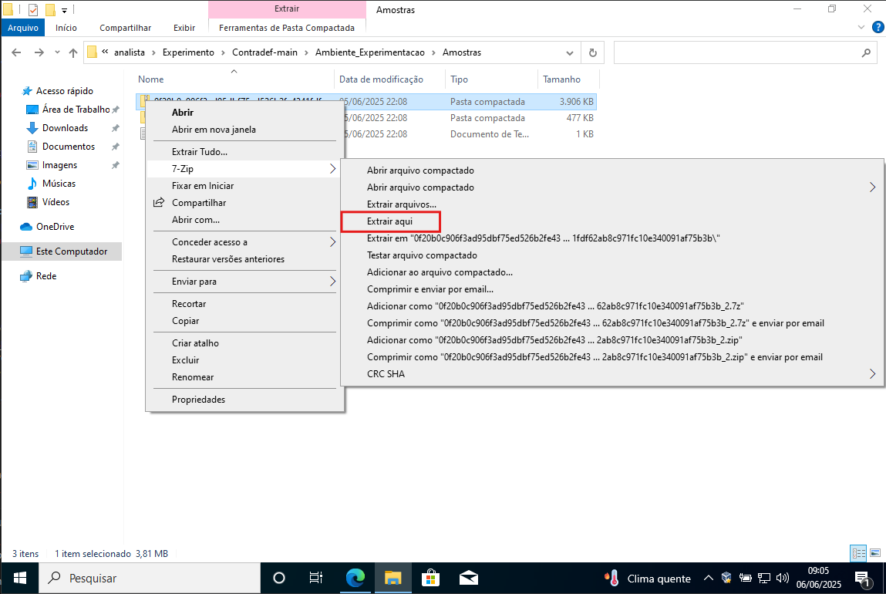
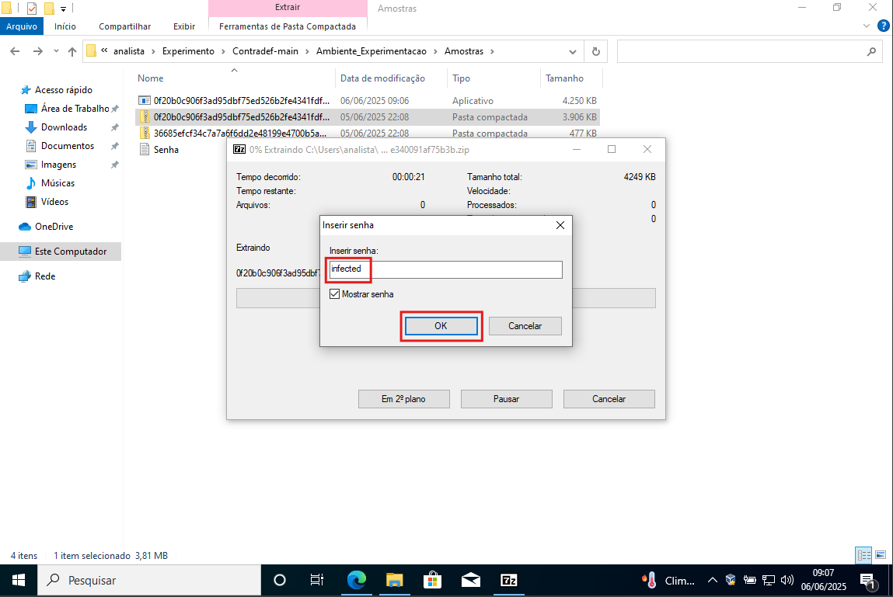
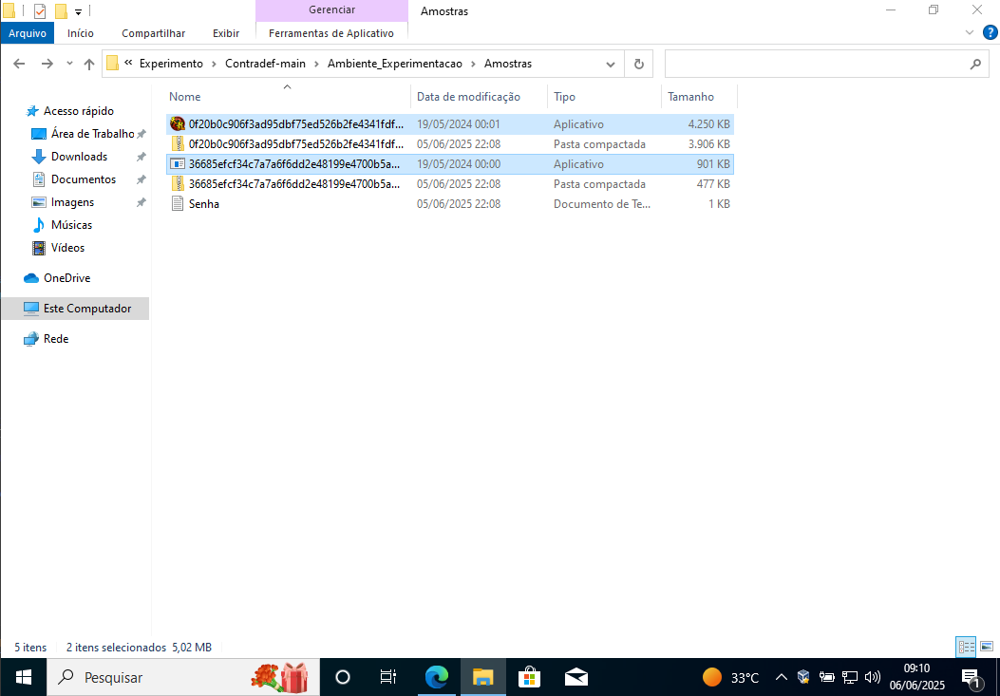
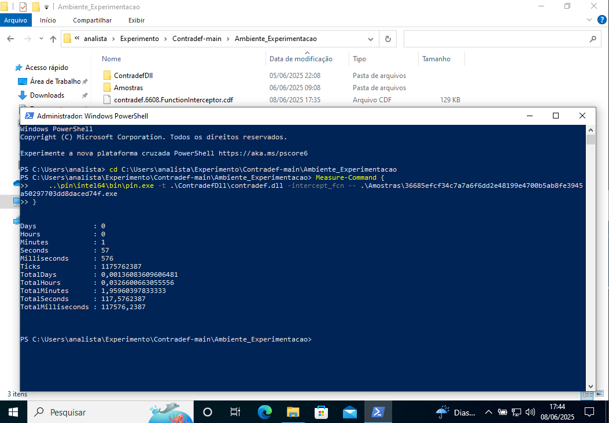
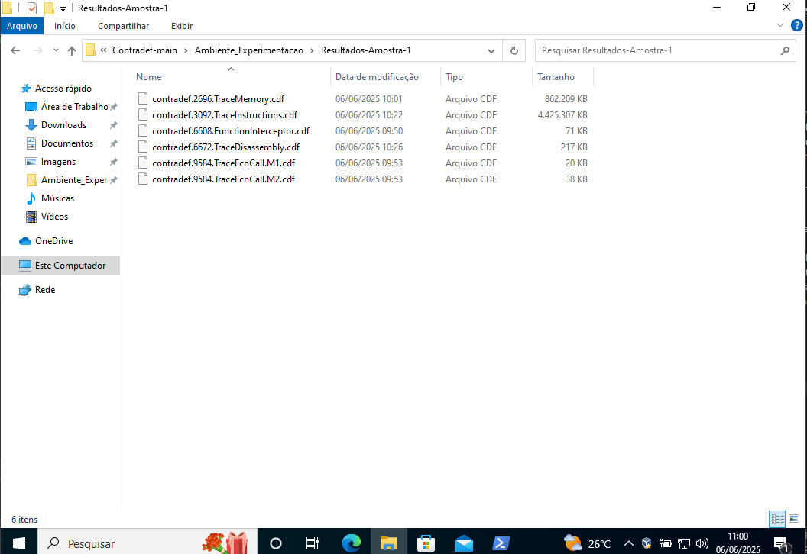
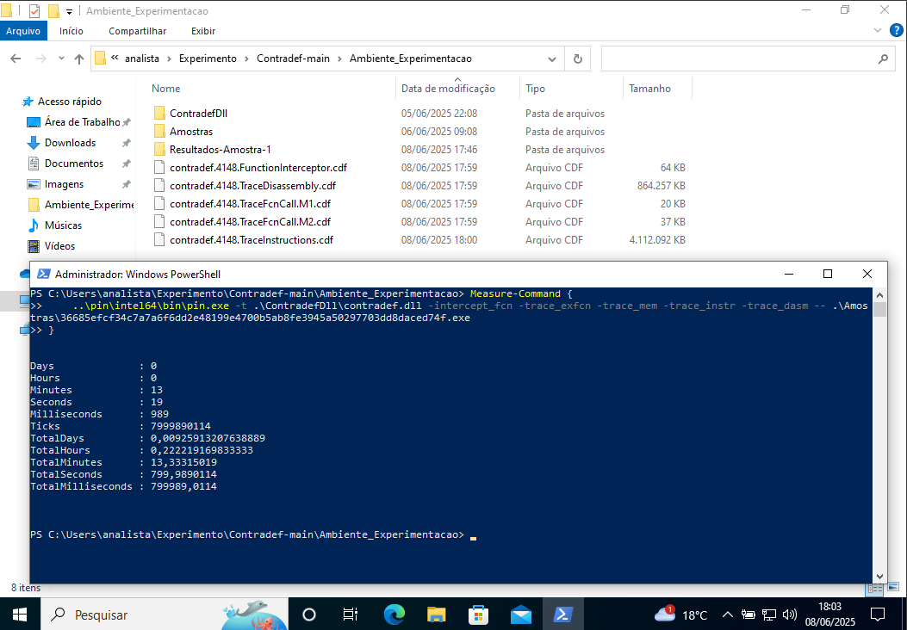
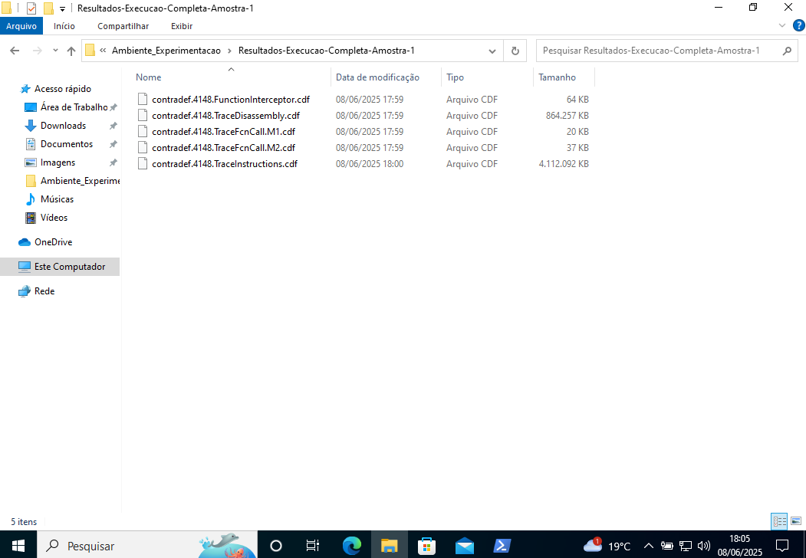

## Executando os experimentos com a Contradef

> Partimos de uma VM já configurada (snapshot **Base-Tools**) com o repositório baixado e descompactado.  
> Nesta etapa desligamos a rede da VM, instalamos o 7-Zip e extraímos as
> amostras com a senha _infected_.  
> As capturas ilustram o fluxo completo em
> `Contradef-main\Ambiente_Experimentacao`.

>## ⚠️ **Importante:** 
>    - Execute cada passo a seguir **somente dentro da VM de análise** para evitar comprometimento do host.

---

### 1. Desconectar a rede da VM

1. **Desligue** a máquina virtual se estiver ligada.  
2. No VirtualBox, abra **Configurações → Rede → Adaptador 1**.  
3. Em **Conectado a**, escolha **Não conectado** e confirme em **OK**.

<p align="center"></p>

Assim a amostra não terá acesso externo durante a análise.

---

### 2. Instalar o 7-Zip

1. Baixe o instalador `7z24xx-x64.exe` (ou versão mais recente).  
2. Execute o arquivo e clique em **Install** para aceitar o caminho
   padrão `C:\Program Files\7-Zip`.

<p align="center"></p>

O 7-Zip será integrado ao menu de contexto do Explorador.

---

### 3. Descompactar as amostras

Em cada amostra compactada, repetir o seguinte procedimento:

1. Navegue até **`Contradef-main\Ambiente_Experimentacao\Amostras`**.  
2. Clique com o botão direito no ZIP da amostra → **7-Zip → Extrair aqui**.

<p align="center"></p>

3. Insira a senha **infected** quando solicitada e confirme em **OK**.

<p align="center"></p>

4. Verifique que o executável `.exe` foi criado na mesma pasta.

<p align="center"></p>

> ⚠️ **Não abra** o executável — ele será chamado apenas pelo Pin/Contradef
> nos próximos passos.

A VM está pronta para a execução da Contradef: rede desconectada, 7-Zip instalado e amostras
descompactadas.

---

### 4. Abrir o terminal no diretório de trabalho

1. Abra o PowerShell como Administrador
2. Ir para o diretório `Ambiente_Experimentacao` do repositório. Ex.:

```powershell
cd "C:\Users\analista\Experimento\Contradef-main\Ambiente_Experimentacao"
```

---

### 5. Gerar traces módulo a módulo (Ex. amostra 1)

Para cada flag execute o Pin + Contradef, por exemplo:

```powershell
Measure-Command {
   ..\pin\intel64\bin\pin.exe -t .\ContradefDll\contradef.dll -intercept_fcn -- .\Amostras\36685efcf34c7a7a6f6dd2e48199e4700b5ab8fe3945a50297703dd8daced74f.exe
}
```
```powershell
Measure-Command {
   ..\pin\intel64\bin\pin.exe -t .\ContradefDll\contradef.dll -trace_exfcn -- .\Amostras\36685efcf34c7a7a6f6dd2e48199e4700b5ab8fe3945a50297703dd8daced74f.exe
}
```
```powershell
Measure-Command {
   ..\pin\intel64\bin\pin.exe -t .\ContradefDll\contradef.dll -trace_mem -- .\Amostras\36685efcf34c7a7a6f6dd2e48199e4700b5ab8fe3945a50297703dd8daced74f.exe
}
```
```powershell
Measure-Command {
   ..\pin\intel64\bin\pin.exe -t .\ContradefDll\contradef.dll -trace_instr -- .\Amostras\36685efcf34c7a7a6f6dd2e48199e4700b5ab8fe3945a50297703dd8daced74f.exe
}
```
```powershell
Measure-Command {
   ..\pin\intel64\bin\pin.exe -t .\ContradefDll\contradef.dll -trace_dasm -- .\Amostras\36685efcf34c7a7a6f6dd2e48199e4700b5ab8fe3945a50297703dd8daced74f.exe
}
```

Cada execução cria um arquivo `contradef.<PID>.<Modulo>.cdf`.

<p align="center"></p>

---

### 6. Guardar os resultados da amostra (Ex. amostra 1)

1. Crie uma pasta, por ex. **Resultados-Amostra-1** dentro de
   `Ambiente_Experimentacao`.
2. Mova todos os `.cdf` recém-gerados para essa pasta.

<p align="center"></p>

---

### 7. Captura “completa” (todos os módulos) (Ex. amostra 1)

Quando precisar de todos os traces de uma só vez:

```powershell
Measure-Command {
   ..\pin\intel64\bin\pin.exe -t .\ContradefDll\contradef.dll -intercept_fcn -trace_exfcn -trace_mem -trace_instr -trace_dasm -- .\Amostras\36685efcf34c7a7a6f6dd2e48199e4700b5ab8fe3945a50297703dd8daced74f.exe
}
```

<p align="center"></p>

Em seguida, mova os `.cdf` para uma pasta dedicada, como
**Resultados-Execucao-Completa-Amostra-1**.

<p align="center"></p>

---

### 8. Repetir os passos 5, 6 e 7 com a amostra 2

---

### Boas-práticas

* **Isolamento** – restaure o snapshot limpo após cada amostra para evitar contaminação cruzada.
* **Organização** – use uma pasta por amostra; os nomes dos logs incluem o *PID*, o que ajuda a agrupar logs dos módulos para por execução e manter distintos resultados evitando sobrescritas.
* **Desempenho** – SSD/NVMe melhora muito a gravação dos *logs*; em HDDs o tempo de execução pode aumentar drasticamente.

Seguindo estes passos você reproduz os experimentos descritos no artigo.

[Voltar para a documentação principal](https://github.com/contradef/Contradef?tab=readme-ov-file#82-reproduzindo-os-experimentos-ver-detalhes)